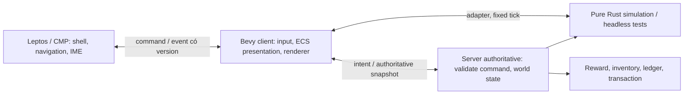

# Quyết định 0003 — dùng Bevy cho game client MyVa

- **Ngày:** 2026-10-09.
- **Trạng thái:** **đã chốt lựa chọn engine** theo [#8](https://github.com/loveoverflowcom/myva/issues/8); khả năng tích hợp từng platform có gate riêng, chưa mặc nhiên đạt.
- **Phạm vi:** [D01 / #9](https://github.com/loveoverflowcom/myva/issues/9). Thay duy nhất lựa chọn Macroquad tại mục 3 của [ADR 0001](0001-project-foundation.md).
- **Số ADR:** issue đề xuất `0002-bevy-engine-adoption`, nhưng `0002` đã dành cho [đề xuất cấu trúc thế giới](0002-lineages-world-structure.md). Dùng `0003` để giữ lịch sử và link hiện hữu.

## Bối cảnh và quyết định

MyVa cần mở rộng một game hành động 2D HD sang nhiều actor, trạng thái combat, AI và nội dung có vòng đời riêng. Chọn **Rust + Bevy** cho game client, với ECS/schedule để tách trách nhiệm và renderer/asset pipeline có khả năng phát triển cùng gameplay. Đây là quyết định kiến trúc, không phải tuyên bố Bevy đã đạt budget MMORPG hoặc đã nhúng được vào CMP.

Leptos tiếp tục sở hữu web shell; Compose Multiplatform tiếp tục sở hữu mobile shell. Render game mobile phải native. Tên MyVa/Thần Mạch, nhánh `develop`, fairness, luật kinh tế, server authoritative và phạm vi GDD giữ nguyên. Không dùng WebView để hoàn thành gate native.

`crates/graybox` vẫn là **mã Macroquad lịch sử đang chạy**. Nó giữ giá trị đối chiếu combat/replay; chưa được chuyển sang Bevy và không phải mẫu triển khai mới. [#12](https://github.com/loveoverflowcom/myva/issues/12) xây foundation ECS/headless, rồi [#2](https://github.com/loveoverflowcom/myva/issues/2) chuyển client combat lên foundation đó. D01/D02/D03 không tự mở rộng sang viết lại boss hoặc toàn bộ gameplay.

## Ownership và boundary đã chốt

- Giữ `myva-sim` và `myva-economy` là Rust thuần, không phụ thuộc renderer, window, asset, audio hoặc `DefaultPlugins`. Domain state và command/event schema thuộc core, presentation và input device thuộc Bevy client.
- D04 dùng adapter ECS gọi core theo fixed step; thứ tự phải rõ `input → movement → collision → combat → status → events`. Không đặt luật theo render FPS. ECS handle `Entity` không làm ID mạng/lưu trữ; cần ID miền riêng, tick, sequence và protocol version.
- Khi có consumer cần ECS headless, chỉ thêm `bevy_ecs = "=0.20.0"`/`bevy_app` với feature cần thiết sau khi kiểm chứng. Đây là lựa chọn cho adapter, **chưa phải dependency của pure core**. Không kéo Bevy renderer/Winit/asset vào server để dùng chung luật.
- Server mới xác nhận damage, reward, inventory và ngân sách. Client, shell, bridge hoặc replay local không được mint reward hay sửa ledger authoritative. Dùng chung Rust không làm kết quả do client gửi trở thành đáng tin.
- Replay có seed/config/tick rõ. Lõi hiện hữu dùng số nguyên; phần mới dùng float phải đo sai lệch native/WASM trước khi hứa deterministic. Không suy ra bit-identical từ ECS hoặc fixed timestep.

## Phiên bản và feature policy

Pin trực tiếp trong manifest và commit `Cargo.lock`; dùng `rust-toolchain.toml` để chọn compiler. Đối chiếu ngày 09/10/2026 với package registry/source chính thức Bevy `0.20.0`, không dùng sample `main` như hợp đồng API [S1–S3].

| Thành phần | Pin/quyết định | Giới hạn bằng chứng |
| --- | --- | --- |
| Rust | `1.97.1` | `bevy 0.20.0` khai báo `rust-version = "1.97.1"`; Rust `1.96.1` cũ của máy không đáp ứng |
| Bevy client | `=0.20.0`, `default-features = false` | Version/feature xác nhận từ package; compile/run ghi trong báo cáo platform |
| Leptos shell | `=0.8.22`, feature `csr` | D03 dùng CSR; chưa đưa SSR/hydration vào spike |
| Pure core | `myva-sim`, `myva-economy`, không phụ thuộc Bevy | Giữ test CLI/headless; schema lệnh/sự kiện thuộc `myva-sim` |
| ECS adapter (D04) | `myva-gameplay`: `bevy_app`, `bevy_ecs`, `bevy_time` `=0.20.0`, `default-features = false`, `std` | Headless native và build wasm32; chưa chạy trong client render |
| CMP/Kotlin | CMP `1.12.0`, Kotlin/Compose compiler `2.4.20`, activity-compose `1.12.4` | D02 đã compile/package Android shell phương án B; runtime/device và iOS chưa được xác nhận |
| Android/iOS tooling | Theo [báo cáo native](../reports/native-feasibility.md) và manifest prototype | Version build standalone không chứng minh CMP embedding |

D03 bật nhóm feature web cần cho cảnh 2D nhỏ: `std`, `async_executor`, `bevy_asset`, `bevy_log`, `bevy_color`, `bevy_camera`, `bevy_core_pipeline`, `bevy_render`, `bevy_sprite`, `bevy_sprite_render`, `bevy_window`, `bevy_winit`, `webgl2`; feature input/format chỉ thêm khi source sử dụng. Manifest của `crates/web-game` là danh sách chính xác khi build. Không bật `default` (gồm 2D, 3D, UI, audio) hoặc umbrella `2d` chỉ vì tên phù hợp: chúng kéo thêm plugin/platform ngoài cảnh spike [S2]. WebGL2 là cấu hình D03 cần đo, không khóa backend mobile hay loại bỏ thử nghiệm WebGPU tương lai.

Plugin Bevy và runtime skeletal 2D cần kiểm phiên bản, license, target và ngân sách riêng; không kế thừa plugin bất kỳ vì có cùng tên major. Các feature native như `android-game-activity`, lựa chọn activity/backend và ABI không được suy từ feature web.

## App lifecycle và cách tích hợp

**Web D03:** hai WASM bundle: Leptos CSR shell và Bevy game. Game được load sau khi document/canvas sẵn sàng trong iframe cùng origin. Message bridge có version, kiểm origin/source và session của lần mount; shell sở hữu navigation/IME, game sở hữu canvas/render loop. Rời game tháo document iframe và listener/handle của shell. Cách này tạo ranh giới hủy toàn runtime; chưa tuyên bố `AppExit` rồi khởi động lại Winit trong cùng document là an toàn. Không truyền token qua URL hoặc dùng bridge shell làm giao thức authoritative. Resize/DPR/focus/visibility, tải lỗi, enter/exit lặp và memory phải đo trong D03. Nếu thêm SSR sau này, không khởi tạo Bevy ở server hoặc trước hydration.

**Native D02:** `WinitPlugin` tạo event loop và thay runner; `run_on_any_thread` chỉ áp dụng Linux/Windows. Sample mobile Bevy có `#[bevy_main]` và GameActivity, là **ứng dụng native độc lập** [S3–S4]. `AndroidView`/`UIKitView` là hook chứa view của shell, không tự biến sample thành renderer nhúng CMP [S5–S6]. Phải chứng minh ai sở hữu Activity/view, native surface, thread/context, tick, input, audio và destroy trước khi cam kết adapter.

Source audit D02 tìm blocker cụ thể ở winit `0.30.13`: runner iOS kiểm `UIApplication` chưa tồn tại rồi tự gọi `UIApplicationMain`. Gọi stock `App::run()` từ controller CMP đã khởi động UIKit sẽ bị assertion chặn; cần custom runner hoặc đảo ownership app cho cả A/B trên iOS. Probe Linux cũng tái hiện lỗi `RecreationAttempt` khi dựng event loop lần hai, nên việc drop rồi tạo lại app không tự chứng minh cleanup/re-entry. Đây là bằng chứng source/probe, chưa phải kiểm tra thiết bị; chi tiết trong [báo cáo native](../reports/native-feasibility.md).

Ưu tiên đánh giá (A) renderer nhúng native view trong CMP; nếu không khả thi với chi phí chấp nhận được, đánh giá (B) màn Bevy native độc lập do CMP điều hướng. B phải chứng minh đi/về shell và phục hồi trạng thái trên thiết bị, không chỉ mở được executable. ABI dự kiến chỉ là boundary `create/resize/pause/resume/enqueue_input/poll_events/destroy`; chưa chốt handle, allocator hoặc backend khi chưa có implementation kiểm chứng.

## Compatibility matrix và gate

`KNOWN` = có nguồn/API hoặc bằng chứng kiểm tra chỉ đúng phạm vi ghi lại; `UNKNOWN` = chưa có bằng chứng đủ; `BLOCKED` = hiện thiếu prerequisite cụ thể. Đây là trạng thái kiến thức, khác kết quả từng test `PASS/FAIL/BLOCKED/NOT_RUN`. Mỗi báo cáo phải ghi commit, command, config, platform/device và artifacts; build thành công không đồng nghĩa device-tested.

| Hạng mục | Trạng thái | Bằng chứng / phần chưa chứng minh | Owner tiếp theo |
| --- | --- | --- | --- |
| Bevy 0.20 và feature/MSRV | KNOWN | Manifest registry và source tag `v0.20.0` [S1–S4] | D01, người nâng dependency |
| Pure Rust simulation/economy hiện hữu | KNOWN về boundary | `crates/sim`, `crates/economy` | #2 và #3 |
| ECS headless + core adapter | KNOWN headless; client render UNKNOWN | Fixed tick, mirror, authority và replay chạy không GPU; native ECS và lõi WASM cùng hash trên fixture ([D04](../technical/gameplay-foundation.md#9-bằng-chứng)). Client Bevy, prediction và mạng chưa chạy | D04 / #12, #2 |
| Web canvas API và CSR | KNOWN về API | Bevy `Window.canvas`, `fit_canvas_to_parent`; Leptos CSR [S7–S8] | D03 / #11 |
| Web shell + Bevy end-to-end | KNOWN trong Chrome desktop; matrix còn thiếu | 30 vòng navigation, focus/touch emulation và lỗi tải đã kiểm tra; browser mobile thật, presentation FPS/GPU và audio còn thiếu trong [báo cáo D03](../reports/web-feasibility.md) | D03 / #11 |
| Standalone Bevy Android/iOS | KNOWN về sample chính thức | Không suy ra device run hoặc CMP embedding [S3] | D02 / #10 |
| CMP native view embedding | UNKNOWN về adapter; stock runner iOS bị chặn | Source audit thấy UIKit ownership conflict và probe event-loop re-entry; chưa có adapter/surface/lifecycle được xác nhận | D02 / #10 |
| Android thật: render, CMP navigation, lifecycle, touch/IME/audio | BLOCKED | Chưa có thiết bị ADB kết nối; xem [báo cáo D02](../reports/native-feasibility.md) | D02 / #10, người cung cấp thiết bị |
| iPhone thật: render, CMP navigation, lifecycle, safe area/IME/audio | BLOCKED | Máy Linux không có Xcode/macOS và thiết bị iPhone; xem báo cáo D02 | D02 / #10, người cung cấp host/device |
| 2D asset pipeline, memory/FPS/build budget | UNKNOWN | Placeholder không chứng minh tải production; đo theo platform đã qua gate | D05 / #13 |

Không đánh dấu #10 hoàn thành trước khi có báo cáo Android và iOS thật riêng biệt. Không dùng một platform PASS để đóng phần chưa chạy của platform khác.

## Trade-off và rollback

Bevy đem lại ECS/scheduling và hệ thống rendering/asset có thể mở rộng, nhưng thêm chi phí compile, binary/WASM download, RAM/GPU, quản lý asset handles, version/plugin churn và tích hợp host loop. Phải đo size, cold/warm startup, frame time và memory; giảm feature/scope trước khi âm thầm nâng budget. Hệ sinh thái không phải bằng chứng readiness của MyVa.

Gate thất bại cho phép đổi **cách tích hợp**: lifecycle/bridge, document boundary trên web, hoặc hướng A → B native có báo cáo chi phí. Không tự đảo engine về Macroquad, tự chọn engine khác hoặc đổi mobile thành WebView. Thay engine/platform cần ADR mới có bằng chứng; giữ core thuần Rust để giới hạn phạm vi thay đổi.

## Quan hệ backlog

- [#1](https://github.com/loveoverflowcom/myva/issues/1) là spike Macroquad cũ, **superseded bởi #10**; nhánh/đầu ra cũ không là hợp đồng triển khai mới.
- [#7](https://github.com/loveoverflowcom/myva/issues/7) nâng engineering skills/tooling sang Bevy; instructions engine-specific phải theo ADR này. Thay docs không đồng nghĩa bộ skills đã triển khai.
- #9 → #10 native và #11 web chạy song song; #12 chốt adapter/headless sau boundary #9. #13 đo pipeline theo platform đã vượt gate.
- #2 giữ scope kit/boss/playtest, chuyển sang Bevy + foundation #12; #3 economy vẫn độc lập engine; #4 slice chờ gate cần thiết theo platform. #5 online và #6 world expansion giữ nguyên điều kiện, không kéo sớm vì đổi engine.

## Nguồn chính thức

Kiểm tra ngày **09/10/2026**. Trang release không truy cập được qua web reader tại thời điểm đọc; API docs `0.20.0` đã được đối chiếu cùng package `bevy-0.20.0/Cargo.toml` tải từ registry và raw source tag `v0.20.0`. Không coi URL release tự nó là bằng chứng chạy được.

- **[S1]** [Bevy 0.20 release](https://bevy.org/news/bevy-0-20/); [manifest tag v0.20.0](https://github.com/bevyengine/bevy/blob/v0.20.0/Cargo.toml).
- **[S2]** [Feature manifest Bevy 0.20.0](https://docs.rs/crate/bevy/0.20.0/features).
- **[S3]** [Mobile manifest](https://github.com/bevyengine/bevy/blob/v0.20.0/examples/mobile/Cargo.toml) và [mobile entry/lifecycle](https://github.com/bevyengine/bevy/blob/v0.20.0/examples/mobile/src/lib.rs).
- **[S4]** [WinitPlugin: event loop, runner và platform thread restriction](https://github.com/bevyengine/bevy/blob/v0.20.0/crates/bevy_winit/src/lib.rs).
- **[S5]** [AndroidView trong Compose](https://developer.android.com/develop/ui/compose/migrate/interoperability-apis/views-in-compose).
- **[S6]** [CMP và UIKit](https://kotlinlang.org/docs/multiplatform/compose-uikit-integration.html).
- **[S7]** [Bevy Window: canvas/resize/browser input](https://github.com/bevyengine/bevy/blob/v0.20.0/crates/bevy_window/src/window.rs).
- **[S8]** [Leptos: CSR và SSR là hai đường tích hợp](https://book.leptos.dev/getting_started/index.html).
