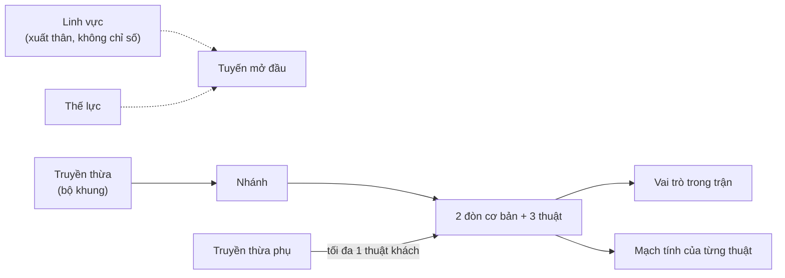

# MyVa — Thần Mạch: truyền thừa, vai trò và năm hệ nhân vật ra mắt

> Đề xuất v0.2, 2026-10-09. Phụ thuộc [quyết định 0002](../decisions/0002-lineages-world-structure.md) (chưa duyệt).
> Tài liệu này trả lời mục **C** (so sánh phương án phân chia) và **D** (năm hệ cho bản ra mắt) của [báo cáo thiết kế](worldbuilding-report.md).
> Mọi chỉ số là **giả thuyết** cần graybox và mô phỏng ([combat-progression-balance.md](combat-progression-balance.md)); không có truyền thừa nào được coi là đã cân bằng.

**Nhãn dùng trong tài liệu:** **DK** = dữ kiện có nguồn trong [khảo sát thần thoại](../research/mythology-survey.md); **GT** = giả thuyết thiết kế cần đo; **ST** = sáng tác mới của MyVa; **⚠** = nội dung nhạy cảm, phải qua [quy trình duyệt văn hóa](../research/risk-register.md#4-quy-trình-duyệt-văn-hóa).

## 1. Phân tầng khái niệm

Draft gọi mọi thứ là "hệ". v0.2 tách thành sáu tầng, mỗi tầng có một quyết định riêng của người chơi:

| Tầng | Câu hỏi nó trả lời | Người chơi chọn khi nào | Có đổi được? | Ảnh hưởng chỉ số? |
| --- | --- | --- | --- | --- |
| **Linh vực** | Tôi lớn lên ở đâu, mở đầu câu chuyện nào? | Tạo nhân vật (khi có nhiều linh vực phát hành) | Không cần đổi; mọi linh vực đều đến được | **Không** |
| **Thế lực** | Tôi đứng về tổ chức nào trong thế giới? | Theo tuyến truyện và danh vọng | Có, theo quy tắc mùa | Không; chỉ mở nhiệm vụ/mỹ phẩm |
| **Truyền thừa** (= hệ nhân vật) | Tôi chiến đấu bằng bộ khung nào? | Tạo nhân vật, sau khi thử ở sân tập | Có, tại hub; miễn phí trước cấp 10 | Có: bộ khung, vũ khí, cơ chế |
| **Nhánh** | Tôi chuyên sâu hướng nào trong truyền thừa? | Cấp 10 | Có, tại hub, chi phí thấp | Nội tại và thuật thay thế, trong ngân sách |
| **Vai trò** | Tôi làm gì cho đội trong trận này? | Phát sinh từ truyền thừa + nhánh + thuật | Theo loadout | Gián tiếp |
| **Mạch tính** | Đòn của tôi tác động gì lên thế giới và boss? | Gắn với từng thuật | Theo loadout | **Không nhân sát thương**; đổi tương tác |

Quy tắc bất biến (giữ từ [World Bible §2](world-bible.md#2-những-quy-tắc-giữ-thế-giới-nhất-quán) và [quyết định 0001](../decisions/0001-project-foundation.md)):

- Linh vực, diện mạo, giới tính, giọng nói và truyền thừa **độc lập**. Không có bonus theo xuất thân, dân tộc hay vị trí thực của người chơi.
- Truyền thừa **xuyên văn hóa**: mỗi truyền thừa lấy cảm hứng từ một mô-típ xuất hiện ở nhiều nền văn hóa, không đại diện một dân tộc.
- Không thêm nút. Mọi khác biệt của truyền thừa đi qua 8 nút đã định ở [combat.md §12](combat.md#12-điều-khiển-và-khả-năng-tiếp-cận).

## 2. So sánh phương án phân chia hệ nhân vật

Năm phương án được chấm 1–5 (5 là tốt nhất) theo sáu tiêu chí. Điểm là đánh giá định tính của nhóm thiết kế, không phải đo lường.

| Phương án | Bản sắc gameplay | Rủi ro văn hóa (5 = thấp) | Mở rộng dài hạn | Dễ cân bằng | Chi phí sản xuất (5 = thấp) | Khớp docs v0.1 | Tổng |
| --- | ---: | ---: | ---: | ---: | ---: | ---: | ---: |
| A. Mỗi hệ = một châu lục/nền văn hóa | 3 | 1 | 2 | 2 | 1 | 1 | 10 |
| B. Theo nguyên tố (kiểu ngũ hành/tứ đại) | 2 | 4 | 3 | 2 | 4 | 3 | 18 |
| C. Theo vai trò thuần (tank/DPS/healer) | 3 | 5 | 3 | 3 | 4 | 2 | 20 |
| D. Theo loại vũ khí | 3 | 5 | 3 | 4 | 3 | 3 | 21 |
| **E. Theo dòng mạch xuyên văn hóa, mỗi dòng một bộ cơ chế** | **5** | **4** | **5** | **3** | **3** | **5** | **25** |

**Vì sao loại A.** Biến một châu lục thành một "chủng tộc chiến đấu" đi ngược [World Bible §2](world-bible.md#2-những-quy-tắc-giữ-thế-giới-nhất-quán) ("không coi một châu lục là một nền văn hóa"), tạo khuôn mẫu ("Bắc Âu = chiến binh băng tuyết"), và bắt buộc làm 7+ hệ trước khi có hệ nào đủ sâu. Người chơi ở một nước cũng sẽ cảm thấy bị gán vào một lối chơi.

**Vì sao loại B.** Nguyên tố là ngôn ngữ dễ hiểu nhưng đã quá phổ biến, và một hệ năm yếu tố dễ bị đọc nhầm thành ngũ hành Đông Á, kéo theo kỳ vọng tương sinh–tương khắc. Khắc chế theo hệ số sát thương (×1,5 khi khắc) làm kết quả phụ thuộc lựa chọn trước trận hơn là kỹ năng, trái trụ cột "khó thành thạo" của [GDD §3](gdd.md#3-các-trụ-cột-có-thể-kiểm-chứng).

**Vì sao C chỉ giữ làm một tầng.** Vai trò rõ ràng nhưng nhạt bản sắc thần thoại. Một healer bắt buộc mâu thuẫn quy tắc "không kit chỉ khả dụng khi có đồng đội" ([combat.md §8](combat.md#8-khung-hai-kit-còn-lại)). Vai trò được giữ như **tầng phát sinh**, không phải lớp nhân vật.

**Vì sao D chỉ giữ làm một thuộc tính.** Vũ khí quyết định silhouette và đòn cơ bản, nên mỗi truyền thừa vẫn có một họ vũ khí. Nhưng chỉ chia theo vũ khí thì thiếu lý do trong thế giới và thiếu cơ chế đặc trưng.

**Vì sao chọn E.** Thần Mạch đã được định nghĩa là dòng năng lượng trong "đất, nước, sinh vật và ký ức" ([World Bible §1](world-bible.md#1-tiền-đề)). Năm dòng mạch (Thủy, Thạch, Phong, Sinh, Ký) mở rộng trực tiếp định nghĩa đó. Mỗi dòng ứng với một **mô-típ lặp lại ở nhiều nền văn hóa độc lập** (DK, xem [khảo sát §10](../research/mythology-survey.md#10-mô-típ-xuyên-văn-hóa)): núi chống nước, rắn giữ nước, chim thần, người-thú, sợi dệt số mệnh. Vì vậy một truyền thừa lấy cảm hứng từ nhiều nơi mà không gom chúng thành một dân tộc. Ba truyền thừa của slice (Long Lưu, Sơn Cốt, Phong Vũ) khớp ngay ba dòng đầu, nên không phải làm lại thiết kế đã có.

Điểm yếu của E là khó cân bằng hơn A–D vì mỗi truyền thừa có cơ chế riêng. Bù lại bằng ngân sách sức mạnh và mô phỏng ở [combat-progression-balance.md §10–11](combat-progression-balance.md#10-giả-thuyết-cân-bằng-ban-đầu).

**Mạch tính không phải ngũ hành.** Năm Mạch tính không có vòng tương sinh/tương khắc và không nhân sát thương. Chúng chỉ quyết định: (1) tương tác với Mạch cơ trên bản đồ, (2) loại phản ứng của "điểm lệch" trên boss (choáng, lộ điểm yếu, đổi pha). Mỗi boss luôn có ít nhất hai cách mở điểm yếu mà truyền thừa nào cũng làm được ([world-atlas.md §8](world-atlas.md#8-quy-chuẩn-dựng-bản-đồ)).

## 3. Quy tắc và phương án đặt tên

### Quy tắc

1. **Hai âm tiết Hán–Việt hoặc Việt**, theo mẫu `[dòng mạch][phẩm chất]` đã có (Long Lưu, Sơn Cốt, Phong Vũ). Dễ đọc với người Việt, không cần biết chữ Hán.
2. **Tên quốc tế dịch nghĩa**, ghép hai gốc tiếng Anh, ≤ 10 ký tự, để người chơi ngoài Việt Nam đoán được lối chơi.
3. **Linh vực dùng phiên âm** (Vân Thủy → *Van Thuy*), vì địa danh nên giữ âm gốc; truyền thừa dùng dịch nghĩa vì là lựa chọn gameplay.
4. **Không lấy tên dân tộc, quốc gia, thần linh hay báu vật có thật** (không "Naga", "Garuda", "Odin", "Sampo").
5. **Không trùng hình vị giữa linh vực và truyền thừa** để tránh đọc nhầm. Ví dụ hiện có cần xem lại: linh vực "Thạch Phong" (Bắc Mỹ, tương lai) trùng "Phong" của Phong Vũ và nghĩa "đá" của Sơn Cốt.
6. **Kiểm tra nhãn hiệu trước khi công bố**: tra USPTO Trademark Search, WIPO Global Brand Database, cơ sở dữ liệu của Cục Sở hữu trí tuệ Việt Nam, Steam/app store và tên lớp nhân vật trong các game lớn. Bảng dưới **chưa** được tra — đây là việc R-02 ở [content-roadmap.md](../production/content-roadmap.md#6-đầu-việc-đề-xuất).
7. **Tránh tên đã gắn với nhân vật nổi tiếng**, ví dụ *Earthshaker*, *Tidehunter*, *Windranger* (Dota 2), *Lifeweaver* (Overwatch 2), *Bastion* (Overwatch; game Bastion), *Cragheart* (Gloomhaven).

### Phương án cho từng truyền thừa

| Dòng | Phương án 1 | Phương án 2 | Phương án 3 | Chọn | Lý do |
| --- | --- | --- | --- | --- | --- |
| Thủy | **Long Lưu** / *Tidecoil* | Long Lưu / *Dragonflow* | Thủy Mạch / *Rivercoil* | 1 | Giữ tên v0.1; "coil" gợi thân rắn/rồng và dòng xoáy mà không gọi tên sinh vật có thật |
| Thạch | **Sơn Cốt** / *Peakward* | Sơn Cốt / *Stonebone* | Thạch Trụ / *Rootstone* | 1 | "ward" nói rõ vai trò che chắn; *Stonebone* dịch sát nhưng gợi hình xương, không gợi bảo vệ |
| Phong | **Phong Vũ** / *Galewing* | Phong Vũ / *Skyquill* | Phong Vũ / *Rainshear* | 1 | *Galewing* đọc được ngay là gió + cánh; *Skyquill* đẹp nhưng khó phát âm với người Việt |
| Sinh | **Lâm Trảo** / *Rootfang* | Mộc Sinh / *Verdant* | Lâm Trảo / *Wildclaw* | 1 | "Rừng + vuốt" nói rõ lối đánh áp sát; *Rootfang* ghép rễ (sự sống) và nanh (thú). *Mộc Sinh* gợi hồi máu thuần, sai vai trò; *Wildclaw* quá phổ biến |
| Ký | **Tơ Vọng** / *Echoweave* | Ấn Ký / *Threadmark* | Linh Ti / *Spiritsilk* | 1 | "Sợi tơ của tiếng vọng" nói đúng hai cơ chế (sợi neo + tiếng vọng). *Ấn Ký* quen trong truyện tiên hiệp nên kém khác biệt; *Linh Ti* khó hiểu |

Ghi chú phát âm: "Tơ Vọng" có thể bị nghe gần "tơ vương" (thành ngữ chỉ sự vương vấn). Nghĩa gần đó hợp chủ đề ký ức, nhưng cần thử với người chơi miền Nam và miền Trung trước khi chốt.

## 4. Năm truyền thừa cho bản ra mắt

### Tổng quan

| Truyền thừa | Dòng | Vai trò chính / phụ | Cơ chế đặc trưng | Bộ pháp | Họ vũ khí | Độ khó (GT) |
| --- | --- | --- | --- | --- | --- | --- |
| Long Lưu / Tidecoil | Thủy | Du kích / Khống chế | Phản đòn và đổi hướng dòng chảy | Lướt Dòng: lướt xa hơn trên mặt nước, bơi nhanh | Côn (gậy dài) | 3/5 |
| Sơn Cốt / Peakward | Thạch | Tiên phong / Đột kích (phá thủ) | Thế Núi: giáp một đòn trong đòn nặng; đỡ tiến | Trụ Đá: lao xuống phá nền nứt; không nhảy kép | Chùy + khiên tay | 2/5 |
| Phong Vũ / Galewing | Phong | Xạ kích / Du kích | Góc bắn trên không, đánh dấu | Lượn Gió: nhảy kép, giữ nhảy để lượn ngắn | Cung ngắn + dao găm | 3/5 |
| Lâm Trảo / Rootfang | Sinh | Đột kích / Tiên phong (bám trụ) | Hoang Sinh: lấy lại máu bằng phản công | Leo Vách: bám và bật vách | Trảo đao đôi | 3/5 |
| Tơ Vọng / Echoweave | Ký | Khống chế / Hộ trợ | Vọng (tiếng vọng lặp thuật) + Neo (sợi giữa hai điểm) | Móc Neo: phóng sợi rồi kéo mình tới điểm neo | Thoi tơ (dây phóng) | 4/5 |

Phủ vai trò: mỗi vai trò trong sáu vai trò có ít nhất một truyền thừa chính hoặc phụ, và không truyền thừa nào là healer bắt buộc. Hồi phục đồng đội chỉ là phần thưởng thêm khi chơi nhóm (Sơn Cốt che chắn, Lâm Trảo nhánh Rễ Sống, Tơ Vọng nhánh Kết Tơ).

### Kho kỹ năng chung cho mọi truyền thừa

- 2 đòn cơ bản (nhẹ 3 nhịp, nặng) + **6 thuật trong kho** (3 thuật lõi + mỗi nhánh mở 1–2 thuật thay thế). Trang bị 3 thuật, một thuật chọn làm đại thuật ([combat.md §2](combat.md#2-bộ-hành-động-và-trạng-thái)).
- 1 nội tại truyền thừa + 1 nội tại nhánh. Không có thanh nội tại cộng dồn vô hạn.
- Bộ pháp là **biến thể của nhảy/lướt chung**, không thêm nút, và không thay thế đường đi chính của bản đồ.
- Tên thuật của Long Lưu, Sơn Cốt và Phong Vũ giữ nguyên từ [combat.md §7–8](combat.md#7-kit-mẫu-long-lưu); thuật mới được đánh dấu **ST**.

---

### 4.1 Long Lưu / Tidecoil — dòng Thủy

**Tên và ý nghĩa.** "Long" (rồng, thân dài uốn lượn) + "Lưu" (dòng chảy). Người dùng Long Lưu không chặn sức mạnh mà dẫn nó đổi hướng.

**Nguồn cảm hứng (DK, xem [khảo sát](../research/mythology-survey.md)).**

| Mô-típ | Ví dụ có nguồn | Mức dùng |
| --- | --- | --- |
| Rắn/rồng nước hiền, mang nước và mùa màng | Rồng và giao long trong truyền thuyết Việt; nāga trong văn hóa Đông Nam Á và Nam Á | 1–2 ⚠ (rồng gắn với nguồn gốc dân tộc Việt; nāga là hình tượng tôn giáo đang thờ) |
| Trị thủy bằng khơi dòng thay vì đắp chặn | Vũ (Yu) khơi kênh thành công sau khi Cổn (Gun) đắp đê thất bại | 3 |
| Dòng chảy đảo chiều theo mùa | Sông Tonlé Sap chảy ngược vào Biển Hồ mỗi mùa lũ | 3 (hiện tượng tự nhiên) |
| Quản lý nước chung | Hệ thống subak và đền nước ở Bali | 2 ⚠ (gắn triết lý Tri Hita Karana và nghi lễ Hindu Bali) |

**Lịch sử trong MyVa (ST).** Sau Cuộc Phân Dòng, những người chèo đò ở các bến sông học cách "đi theo dòng" khi lũ về: thay vì chống, họ đổi hướng thuyền theo xoáy nước. Hội Đò truyền nghề ấy thành võ. Long Lưu chia thành hai lối: người giữ đò (nhánh Hồi Triều) và người vượt ghềnh (nhánh Liên Lưu).

**Triết lý.** *Khơi chứ không chặn.* Sức mạnh bị chặn sẽ tìm đường phá ra; sức mạnh được dẫn sẽ nuôi đồng ruộng. Mặt tối: người tin mình đủ giỏi để dẫn mọi dòng có thể trở thành Kẻ Giữ Đập.

**Vùng khởi đầu và đạo trường.** Bến Lau (Vân Thủy), sân tập trên nhà sàn nổi. Kiến trúc: nhà sàn, cầu tre, cột đánh dấu mực nước, đèn treo trên mặt nước.

**Phong cách chiến đấu.** Tầm trung 2–6 m. Đánh nhẹ quét vòng cung, ép đối thủ vào nhịp rồi phản đòn khi họ cam kết. Mạnh nhất khi đối thủ tấn công đoán trước được.

**Cơ chế đặc trưng — Thuận Dòng (GT).** Đỡ hoàn hảo một đạn thường (không phải của boss) sẽ phản nó lại theo hướng đang nhìn. PvP: tối đa một lần mỗi 4 giây; đạn bị phản không được nối khống chế.

| Điểm mạnh | Điểm yếu |
| --- | --- |
| Phản đòn tốt, khắc chế đạn và lối áp sát đoán trước được | Sát thương bộc phát thấp; phải chờ đối thủ hành động |
| Đẩy và kéo mục tiêu, phù hợp khống chế vị trí | Phụ thuộc đỡ; bị lối phá thủ (Sơn Cốt) gây áp lực sức bền |
| Bộ pháp tốt ở vùng có nước | Kém hơn trên nền khô, nhiều tầng cao |

**Kỹ năng.**

| Ô | Tên | Mô tả | Nguồn |
| --- | --- | --- | --- |
| Nhẹ | Gợn Sóng | 3 nhịp côn, nhịp 3 đẩy lùi nhẹ | combat.md |
| Nặng | Phá Lưu | Đòn chẻ, áp lực guard cao | combat.md |
| Thuật lõi | Lưu Tiễn | Đạn nước thẳng, một hit mỗi mục tiêu | combat.md |
| Thuật lõi | Hồi Thế | Tư thế phản đòn phía trước | combat.md |
| Thuật lõi | Triều Dâng | Sóng cận–trung, đẩy; đại thuật mặc định | combat.md |
| Hồi Triều | Xoáy Nước | Vùng xoáy nhỏ làm lệch đạn đi qua trong 1,5 s | ST |
| Liên Lưu | Dòng Xiết | Lướt chém theo đường thẳng, nối được từ nhẹ trúng | ST |
| Liên Lưu | Mưa Giọt | Ba giọt rơi vòng cung, khống chế vùng | ST |
| Nội tại truyền thừa | Thuận Dòng | Như trên | ST |
| Nội tại Hồi Triều | Lặng Như Nước | Hồi Thế thành công hồi 15 sức bền | ST |
| Nội tại Liên Lưu | Nước Chảy Đá Mòn | Trúng liên tiếp cùng mục tiêu tăng áp lực guard, trần +30% | ST |

**Nhánh.** *Hồi Triều* (phản đòn, chống đạn) — vai trò Du kích/Khống chế. *Liên Lưu* (nối đòn tầm trung, ép guard) — vai trò Du kích/Đột kích.

**Mạch tính Thủy (Mạch cơ).** Làm quay guồng nước, đổ đầy máng để nâng phao, dập lửa trên đường đi.

**Nhân vật quan trọng.** An (người hướng dẫn, đã có); **Kẻ Giữ Đập** — được đề xuất là học trò cũ của An (ST), lý giải vì sao An sợ trao quyền cho một người.

**Boss và sinh vật liên quan.** Kẻ Giữ Đập (Đập Cổ); Giao Ngược — boss thế giới ở Biển Hồ Nghịch Dòng; Thuồng Luồng Mắc Lưới — biến thể elite dùng lại rig của Giao Ngược ([world-atlas.md](world-atlas.md#4-vân-thủy)).

**Quan hệ.** Phối hợp: Tơ Vọng (đẩy mục tiêu vào sợi neo), Sơn Cốt (Sơn Cốt giữ tiền tuyến, Long Lưu phản đạn). Khắc chế nhẹ: Lâm Trảo, Phong Vũ. Bị khắc chế nhẹ: Sơn Cốt, Tơ Vọng.

---

### 4.2 Sơn Cốt / Peakward — dòng Thạch

**Tên và ý nghĩa.** "Sơn" (núi) + "Cốt" (xương, cốt lõi). Người đứng như xương sống của núi để người khác đi qua.

**Nguồn cảm hứng.**

| Mô-típ | Ví dụ có nguồn | Mức dùng |
| --- | --- | --- |
| Núi dâng lên chống nước để cứu người | Sơn Tinh nâng đồi chống Thủy Tinh (Việt); Trentren Vilu nâng đất chống Caicai Vilu (Mapuche, Chile) | 1–2 ⚠ (Sơn Tinh được thờ ở Ba Vì; truyện Mapuche gắn cộng đồng bản địa đang sống) |
| Người gánh trời/đất | Atlas (Hy Lạp) | 3 |
| Đá dựng, trụ ranh giới | Đá dựng thời tiền sử ở nhiều nơi | 3 |
| Võ vật, gậy nặng | Vật cổ truyền; gậy *meel* trong zurkhaneh (Iran) | 2 |

**Lịch sử trong MyVa (ST).** Khi Phân Dòng gây lũ, những người làng trên đồi khiêng đá đắp nền cao cho người dưới xuôi chạy lên. Họ học cách "nghe" dòng Thạch trong đá: đá chỉ đứng vững khi biết mình đỡ ai. Một nhánh sau này tin rằng đá nên chặn mọi dòng; nhánh ấy trở thành kỹ sư của Hắc Triều.

**Triết lý.** *Đứng vững để người khác qua.* Phân biệt rõ với lối đắp chặn của Cổn: Sơn Cốt che chắn, không giam giữ.

**Vùng khởi đầu và đạo trường.** Mỏ đá cũ cạnh Đập Cổ. Kiến trúc: bậc đá xếp khan, cột mốc lũ khắc vạch, mái ngói nặng.

**Phong cách chiến đấu.** Gần 0–3 m. Tiến chậm sau khiên, hấp thụ một đòn rồi đáp trả bằng đòn nặng; chuyên phá thủ.

**Cơ chế đặc trưng — Thế Núi (GT).** Sau 250 ms startup của đòn nặng, nhân vật chịu được **một** đòn mà không bị ngắt (vẫn nhận sát thương). Hồi 6 giây. Không áp dụng với đòn ném/không đỡ được của boss. Đỡ khi di chuyển tới trước chậm (Tiến Thủ), tốn thêm 20% sức bền.

| Điểm mạnh | Điểm yếu |
| --- | --- |
| Máu và hiệu quả đỡ cao nhất | Chậm nhất, không nhảy kép, kém trên không |
| Phá thủ, gây áp lực sức bền lên lối dựa vào đỡ | Startup dài, bị đọc là bị phạt |
| Che chắn đồng đội phía sau | Bị thả diều bởi tầm xa và bẫy |

**Kỹ năng.**

| Ô | Tên | Mô tả | Nguồn |
| --- | --- | --- | --- |
| Nhẹ | Nện Đất | 3 nhịp chùy chậm, nhịp 3 đẩy | ST |
| Nặng | Sơn Băng | Đập xuống, có Thế Núi | ST |
| Thuật lõi | Thạch Chấn | Sóng đất ngắn, chỉ trúng mục tiêu đứng trên nền | combat.md (tên) |
| Thuật lõi | Trấn Sơn | Tư thế giáp: chịu một đòn rồi đập trả | combat.md (tên) |
| Thuật lõi | Cốt Kích | Húc vai phá thủ, startup dài | combat.md (tên) |
| Trấn Thủ | Vách Đá | Dựng vách chặn đạn 4 s; cũng là bệ đứng một lần | ST |
| Trấn Thủ | Gánh Núi | Nối với một đồng đội 5 s, nhận thay 30% sát thương của họ | ST |
| Phá Sơn | Nứt Gãy | Đòn bổ không đỡ được, startup ≥ 600 ms, tín hiệu rõ | ST |
| Nội tại truyền thừa | Thế Núi | Như trên | ST |
| Nội tại Trấn Thủ | Núi Vững | Đỡ tốn ít hơn 20% khi có đồng đội phía sau; 10% khi chơi một mình | ST |
| Nội tại Phá Sơn | Đá Lở | Phá thủ thành công rút ngắn hồi Cốt Kích 2 s | ST |

**Nhánh.** *Trấn Thủ* (che chắn, giữ điểm) — Tiên phong/Hộ trợ. *Phá Sơn* (phá thủ, bộc phát) — Tiên phong/Đột kích.

**Mạch tính Thạch.** Phá vách nứt, dựng trụ đá ở ổ cắm đánh dấu, ép đòn bẩy nặng.

**Nhân vật quan trọng.** An (người hướng dẫn nhập môn). **Đốc Kè** (ST) — kỹ sư Hắc Triều dùng Sơn Cốt để đắp tường chuyển lũ sang làng khác; đại diện "đá chặn" đối lập "đá che".

**Boss và sinh vật liên quan.** Đốc Kè (Ruộng Bậc Mây); Tượng Gác Đèo — trên Đèo Gió Mặn, thử thách chứ không phải kẻ thù.

**Quan hệ.** Phối hợp: Phong Vũ (bắn từ sau vách), Lâm Trảo (giữ mục tiêu cho Lâm Trảo áp sát). Khắc chế nhẹ: Lâm Trảo, Long Lưu. Bị khắc chế nhẹ: Phong Vũ, Tơ Vọng.

---

### 4.3 Phong Vũ / Galewing — dòng Phong

**Tên và ý nghĩa.** "Phong" (gió) + "Vũ" (mưa; đồng âm "vũ" là lông cánh). Người mượn cánh chim và gió mùa để đi khắp nơi.

**Nguồn cảm hứng.**

| Mô-típ | Ví dụ có nguồn | Mức dùng |
| --- | --- | --- |
| Chim thần che chở và chữa lành | Simurgh nuôi Zāl, chữa cho Rostam (Shahnameh) | 2 |
| Chim thần là quốc huy | Garuda (Indonesia, Thái Lan) | 1 ⚠ (biểu tượng quốc gia: không làm kẻ thù hay loot) |
| Chim trên trống đồng | Chim Lạc trên trống Đông Sơn | 2 ⚠ (biểu tượng bản sắc Việt) |
| Chim bão cướp vật quyền lực | Anzû cướp Bảng Định Mệnh (Lưỡng Hà) | 3 (dùng cho phản diện/boss) |
| Gió mùa mang mưa | Hệ gió mùa Nam Á và Đông Nam Á | 3 (hiện tượng tự nhiên) |

**Lịch sử trong MyVa (ST).** Sau Phân Dòng, các linh vực mất đường liên lạc. Người đưa tin học theo đàn chim di cư, đọc gió mùa để vượt núi và biển. Phong Vũ ra đời từ nghề đưa tin; hiện nay họ là trinh sát và cung thủ.

**Triết lý.** *Gió không giữ gì, nên đi được khắp nơi.* Tự do, kết nối, nhưng dễ xem nhẹ trách nhiệm ở lại.

**Vùng khởi đầu và đạo trường.** Gò cối xay gió trên Ruộng Bậc Mây. Kiến trúc: tháp canh gió, cờ đuôi nheo đo hướng gió, chuồng chim đưa thư.

**Phong cách chiến đấu.** Xa 5–12 m. Giữ khoảng cách, đổi tầng cao liên tục, bắn từ góc trên không.

**Cơ chế đặc trưng — Lượn Gió (GT).** Nhảy kép, giữ nút nhảy để lượn tối đa 0,8 s. Lướt trên không 1 lần như chung. Không bất tử khi lượn; đạn trúng khi lượn gây hitstun dài hơn 20% (cái giá của cơ động).

| Điểm mạnh | Điểm yếu |
| --- | --- |
| Cơ động trên không và tầm đánh cao nhất | Máu và sức bền đỡ thấp |
| Đánh dấu, trinh sát, xử lý mục tiêu bay | Bị áp sát leo vách (Lâm Trảo) và phản đạn (Long Lưu) |
| Mạnh ở bản đồ nhiều tầng | Yếu trong hành lang hẹp, hang tối |

**Kỹ năng.**

| Ô | Tên | Mô tả | Nguồn |
| --- | --- | --- | --- |
| Nhẹ | Cắt Gió | 3 nhịp dao găm nhanh, tầm ngắn | ST |
| Nặng | Tên Xé Gió | Chạm: bắn nhanh; giữ: tên nạp, xa hơn | ST |
| Thuật lõi | Phong Tiễn | Bắn chéo lên/xuống theo hướng giữ | combat.md (tên) |
| Thuật lõi | Vũ Bộ | Bước trên không đổi vị trí, không bất tử | combat.md (tên) |
| Thuật lõi | Gió Quẩn | Lốc nhỏ đẩy địch, làm chậm đạn đi qua | combat.md (tên) |
| Tiễn Vũ | Mưa Tên | Mưa tên xuống vùng đánh dấu sau 600 ms | ST |
| Tiễn Vũ | Tên Dấu | Đánh dấu mục tiêu 6 s; đồng đội thấy vị trí | ST |
| Phong Bộ | Gió Ngược | Bật lùi và bắn một mũi | ST |
| Nội tại truyền thừa | Lượn Gió | Như trên | ST |
| Nội tại Tiễn Vũ | Tầm Gió | Tên nạp bay xa hơn 25% | ST |
| Nội tại Phong Bộ | Nhẹ Như Gió | Lướt tốn ít hơn 20% sức bền; đòn nhẹ ngay sau lướt nhanh hơn | ST |

**Nhánh.** *Tiễn Vũ* (cung thủ đứng xa) — Xạ kích/Hộ trợ (đánh dấu). *Phong Bộ* (đánh–chạy) — Du kích.

**Mạch tính Phong.** Xoay chong chóng, đẩy vật nhẹ, dùng luồng khí bốc lên để nhảy cao.

**Nhân vật quan trọng.** An (nhập môn). **Én Đen** (ST) — người đưa tin của Hắc Triều, buôn lậu mảnh Mạch Bạ; đại diện tự do không trách nhiệm.

**Boss và sinh vật liên quan.** Én Đen (Vịnh Đá Nổi); Chim Bão Giữ Bảng — boss thế giới ở Song Nguyên, cảm hứng Anzû.

**Quan hệ.** Phối hợp: Sơn Cốt (vách che), Tơ Vọng (Tên Dấu + sợi neo). Khắc chế nhẹ: Sơn Cốt, Tơ Vọng (phá điểm neo từ xa). Bị khắc chế nhẹ: Lâm Trảo, Long Lưu.

---

### 4.4 Lâm Trảo / Rootfang — dòng Sinh (mới)

**Tên và ý nghĩa.** "Lâm" (rừng) + "Trảo" (vuốt). Sức sống của rừng thể hiện qua bản năng săn và khả năng hồi lại sau vết thương.

**Nguồn cảm hứng.**

| Mô-típ | Ví dụ có nguồn | Mức dùng |
| --- | --- | --- |
| Người hoang dã sống cùng thú, được "khai hóa" | Enkidu trong Sử thi Gilgamesh | 3 |
| Cơn biến hình chiến đấu | *Ríastrad* của Cú Chulainn (Ulster, Ireland); chiến binh *berserkir* (sagas Bắc Âu) | 3 / 2 |
| Tục kính hổ | Thờ "ông Ba Mươi"/Sơn quân ở Việt Nam; hổ trong tín ngưỡng sơn thần Hàn Quốc | 1 ⚠ (tín ngưỡng đang thực hành) |
| Cây thần chữa lành | Cây đa và lá thuốc trong truyện Chú Cuội (Việt) | 3 |
| Vũ khí dạng vuốt | Karambit (Đông Nam Á hải đảo), *bagh nakh* (Ấn Độ) | 3 / 2 ⚠ (bagh nakh gắn với nhân vật lịch sử Shivaji) |

**Lịch sử trong MyVa (ST).** Ở vùng rừng đầu nguồn, thợ săn và người hái thuốc nhận ra thú lệch nhịp có thể được "trả nhịp" nếu ai đó chịu đứng trong vòng vuốt của chúng đủ lâu. Lâm Trảo là truyền thừa của những người sống sát nỗi đau đó: họ hồi phục nhờ không bỏ chạy.

**Triết lý.** *Săn để sống, không sống để săn.* Thiên nhiên không hiền, nhưng tàn phá không bao giờ là cân bằng.

**Vùng khởi đầu và đạo trường.** Trại thợ săn trên Rừng Bậc Nước. Kiến trúc: nhà dài mái lá, chòi trên cây, bàn thờ đá cạnh gốc cây cổ thụ (thiết kế mới, không sao chép miếu cụ thể).

**Phong cách chiến đấu.** Sát 0–2 m. Áp sát, nối đòn nhanh, đổi bên (cross-up) để buộc đối thủ đoán hướng đỡ. Càng bị đánh càng phải đánh trả để lấy lại máu.

**Cơ chế đặc trưng — Hoang Sinh (GT).** 50% sát thương nhận vào trở thành "máu hồi được" trong 3 giây; đánh trúng mục tiêu sẽ lấy lại phần đó. PvP: 40% và giảm dần; không nhận từ sát thương môi trường. Cơ chế "lấy lại máu bằng phản công" là ý tưởng game design phổ biến (ví dụ hệ *regain* của Bloodborne); MyVa không sao chép số liệu hay trình bày.

| Điểm mạnh | Điểm yếu |
| --- | --- |
| Bộc phát và tự hồi phục cao nhất | Không có đòn tầm xa; bị thả diều |
| Đổi bên, ép đoán, mạnh khi kề sát | Bị phản đòn (Long Lưu) và giáp (Sơn Cốt) phạt nặng |
| Leo vách, đuổi mục tiêu trên cao | Sức bền đỡ thấp; đứng yên là thua |

**Kỹ năng.**

| Ô | Tên | Mô tả | Nguồn |
| --- | --- | --- | --- |
| Nhẹ | Cào Xé | 3 nhịp vuốt, startup ngắn nhất (mục tiêu 120 ms) | ST |
| Nặng | Vồ | Lao tới đòn nặng, có thể nối sau lướt | ST |
| Thuật lõi | Vồ Mồi | Nhảy vồ tới mục tiêu hoặc vách; đại thuật mặc định | ST |
| Thuật lõi | Gầm Rừng | Tiếng gầm ngắt startup của địch thường gần, đẩy đạn nhẹ; không gây sợ hãi mất điều khiển | ST |
| Thuật lõi | Rễ Siết | Rễ trồi trói ngắn (khống chế mạnh, tính DR chung) | ST |
| Săn Mồi | Nanh Kép | Hai nhịp lướt chém, nhịp hai đổi bên | ST |
| Rễ Sống | Vỏ Cây | Chuyển máu hồi được thành khiên | ST |
| Rễ Sống | Mầm Hồi | Gieo mầm: vùng hồi nhỏ 6 s, có thể bị phá | ST |
| Nội tại truyền thừa | Hoang Sinh | Như trên | ST |
| Nội tại Săn Mồi | Khát Săn | Trúng đòn trong 1 s sau lướt: startup kế tiếp nhanh hơn 10% | ST |
| Nội tại Rễ Sống | Đất Lành | Cửa sổ Hoang Sinh 3 → 4 s; tỷ lệ +10% | ST |

**Đại thuật Thú Tướng (GT).** Vồ Mồi tăng cường: chuỗi ba cú vồ, hiện bóng thú bằng **VFX phủ lên nhân vật**, không đổi sang model khác. Lý do sản xuất: không cần rig thú cho người chơi ([assets-performance.md §2](../technical/assets-performance.md#2-skeletal-animation-là-lựa-chọn-cần-kiểm-chứng)).

**Nhánh.** *Săn Mồi* (áp sát bộc phát) — Đột kích. *Rễ Sống* (bám trụ, hồi phục) — Tiên phong/Hộ trợ nhẹ.

**Mạch tính Sinh.** Mọc dây leo ở hạt giống (leo được), làm sống lại cây khô mở lối, làm dịu thú hoang không tham chiến.

**Nhân vật quan trọng.** **Ngàn** (ST) — người hướng dẫn, thợ săn kiêm người hái thuốc ở đầu nguồn, từ chối giết thú khi còn trả nhịp được. **Thợ Bẫy Hắc Triều** — săn thú lệch nhịp để rút mạch.

**Boss và sinh vật liên quan.** Hổ Mất Nhịp (Hang Vọng Thạch) ⚠ — trận kết thúc bằng trả nhịp, không giết; Vườn Chủ Khô Héo (Song Nguyên).

**Quan hệ.** Phối hợp: Sơn Cốt (giữ chân mục tiêu), Tơ Vọng (sợi neo kéo mục tiêu vào tầm). Khắc chế nhẹ: Phong Vũ, Tơ Vọng. Bị khắc chế nhẹ: Sơn Cốt, Long Lưu.

---

### 4.5 Tơ Vọng / Echoweave — dòng Ký (mới)

**Tên và ý nghĩa.** "Tơ" (sợi tơ) + "Vọng" (tiếng vọng). Ký ức là sợi nối giữa các khoảnh khắc; người Tơ Vọng kéo một khoảnh khắc đã qua trở lại.

**Nguồn cảm hứng.**

| Mô-típ | Ví dụ có nguồn | Mức dùng |
| --- | --- | --- |
| Người dệt số mệnh bên giếng | Các Norn bên giếng Urðarbrunnr dưới cây Yggdrasil (Bắc Âu) | 3 |
| Suối ký ức và sông quên | Mnemosyne và Lethe trong các thẻ vàng Orphic (Hy Lạp) | 3 |
| Người giữ mọi câu chuyện | Anansi giành kho truyện của thần trời Nyame (Akan, Ghana) | 2 |
| Dây thắt nút làm sổ ghi | Khipu của Inca | 2 ⚠ (một số cộng đồng Andes còn giữ khipu) |
| Sợi chỉ duyên | Sợi chỉ đỏ/Nguyệt Lão (Đông Á); thành ngữ "xe duyên" (Việt) | 3 |
| Người giữ ký ức sống | Truyền thống griot/jeli (Tây Phi); cuộc cứu bản thảo Timbuktu năm 2012 | 1 ⚠ (nghề và cộng đồng đang sống) / 2 |

**Lịch sử trong MyVa (ST).** Sau Phân Dòng, mỗi cộng đồng chỉ còn giữ một mảnh ký ức về Đại Mạch. Những người chép truyện ở Song Nguyên phát hiện rằng ký ức được kể lại sẽ để lại "vọng" trong dòng Ký: một tiếng vọng có thể lặp lại một hành động đã xảy ra. Họ dệt các vọng thành sợi để nối các cộng đồng. Người Đo Mạch từng là bậc thầy của truyền thừa này trước khi tin rằng chỉ một bản ghi cố định mới đáng tin.

**Triết lý.** *Một sợi không thành vải.* Ký ức sống thuộc về nhiều người; ký ức bị ghi cứng và độc quyền trở thành công cụ cai trị.

**Vùng khởi đầu và đạo trường.** Hang Vọng Thạch (Vân Thủy, vùng tiếng vọng) và Nhà Bảng ở Cảng Hai Dòng (Song Nguyên). Ở bản ra mắt, Nguyệt dạy nhập môn tại Bến Lau. Kiến trúc: khung cửi treo, vách khắc tranh, kệ cuộn và dây thắt nút.

**Phong cách chiến đấu.** Trung 3–8 m, gián tiếp. Đặt neo và tiếng vọng để tạo đe dọa trễ; thắng bằng bày thế trước khi đối thủ tới gần.

**Cơ chế đặc trưng — Vọng và Neo (GT).**

- **Vọng:** mỗi thuật để lại một tiếng vọng lặp lại thuật đó với 40% hiệu lực sau 0,8 s, **tại vị trí gốc** (không bám theo người dùng). Tiếng vọng không gây khống chế mạnh và không tiêu tài nguyên. Mỗi tiếng vọng có ID riêng do server mô phỏng.
- **Neo:** tối đa 2 điểm neo (3 với nội tại Lưới Chặt). Sợi giữa hai neo làm chậm 20% và đánh dấu kẻ đi qua; đồng đội có thể dùng sợi như dây leo.

| Điểm mạnh | Điểm yếu |
| --- | --- |
| Khống chế vùng và hỗ trợ đồng đội cao nhất | Sát thương trực tiếp thấp nhất |
| Tiếng vọng trễ phá nhịp đỡ hoàn hảo của đối thủ | Phụ thuộc bày thế; bị áp sát nhanh là vỡ |
| Tạo đường đi cho đồng đội (sợi neo) | Neo có thể bị phá từ xa; khó điều khiển trên cảm ứng |

**Kỹ năng.**

| Ô | Tên | Mô tả | Nguồn |
| --- | --- | --- | --- |
| Nhẹ | Đưa Thoi | 3 nhịp phóng thoi tầm trung | ST |
| Nặng | Kéo Sợi | Giật kéo địch nhẹ lại gần; địch nặng/boss không bị kéo | ST |
| Thuật lõi | Neo Mạch | Phóng neo vào bề mặt hoặc địch; giữ nút để kéo mình tới neo | ST |
| Thuật lõi | Lưới Tơ | Căng sợi giữa các neo thành bẫy | ST |
| Thuật lõi | Hồi Vọng | Đổi chỗ với tiếng vọng gần nhất trong 6 m; đại thuật mặc định | ST |
| Dệt Lưới | Kén Tơ | Trúng 3 lần bởi sợi trong 2 s thì bị trói 600 ms (khống chế mạnh, DR chung) | ST |
| Dệt Lưới | Ảo Vọng | Tiếng vọng mô phỏng dáng đứng/chạy; địch thường nhắm vào nó | ST |
| Kết Tơ | Chỉ Hộ Mệnh | Nối với đồng đội 8 s: họ nhận khiên; chơi một mình thì nối với neo để tự nhận khiên nhỏ | ST |
| Kết Tơ | Nhắc Nhịp | Đồng đội được nối có cửa sổ đỡ hoàn hảo +40 ms trong 1 s kế tiếp | ST |
| Nội tại truyền thừa | Vọng | Như trên | ST |
| Nội tại Dệt Lưới | Lưới Chặt | Thêm 1 neo tối đa | ST |
| Nội tại Kết Tơ | Xe Duyên | Đồng đội được nối hồi sức bền nhanh hơn 15% | ST |

**Đại thuật Vạn Vọng (GT).** Mọi tiếng vọng tạo trong 4 giây trước đó lặp lại cùng lúc với 60% hiệu lực. Ngân sách sát thương và khống chế vẫn áp dụng như mọi chuỗi ([combat.md §6](combat.md#6-combo-và-cancel)).

**Nhánh.** *Dệt Lưới* (bẫy, khống chế) — Khống chế. *Kết Tơ* (nối đồng đội, khuếch đại kỹ năng của họ) — Hộ trợ. *Nhắc Nhịp* thưởng cho kỹ năng của đồng đội thay vì bù sai lầm, đúng trụ cột "kỹ năng tạo khác biệt".

**Mạch tính Ký.** Hiện vọng ảnh (cảnh ký ức) ở di tích, kích hoạt tranh khắc cơ quan, phục hồi Vùng Quên nhanh hơn.

**Nhân vật quan trọng.** **Nguyệt** (ST) — người chép vọng của Nhà Bảng, chạy trốn Hắc Triều tới Bến Lau; mở đường sang Song Nguyên. **Người Đo Mạch** — phản diện chính, bậc thầy Tơ Vọng đã quay sang ghi chép độc quyền.

**Boss và sinh vật liên quan.** Kẻ Chép Câm (Đài Đo Sao) — cỗ máy xóa ký ức; Người Giữ Kênh Hóa Tướng (Kênh Ngầm Mười Giếng).

**Quan hệ.** Phối hợp: Long Lưu (đẩy địch vào sợi), Lâm Trảo (kéo mục tiêu vào tầm vồ), Phong Vũ (Tên Dấu + bẫy). Khắc chế nhẹ: Long Lưu (tiếng vọng trễ phá phản đòn), Sơn Cốt (làm chậm lối tiến chậm). Bị khắc chế nhẹ: Lâm Trảo, Phong Vũ.

## 5. Ma trận quan hệ

Mỗi truyền thừa **khắc chế nhẹ hai** và **bị khắc chế nhẹ bởi hai** truyền thừa khác (vòng 5 phần tử). "Nhẹ" nghĩa là mục tiêu thắng 52–55% khi cùng trình độ trong PvP chuẩn hóa, không phải khắc chế cứng. Đây là **giả thuyết thiết kế**; ngưỡng kiểm chứng ở [combat-progression-balance.md §11](combat-progression-balance.md#11-phương-pháp-kiểm-chứng).

| Hàng gặp cột | Long Lưu | Sơn Cốt | Phong Vũ | Lâm Trảo | Tơ Vọng |
| --- | --- | --- | --- | --- | --- |
| **Long Lưu** | — | − | + | + | − |
| **Sơn Cốt** | + | — | − | + | − |
| **Phong Vũ** | − | + | — | − | + |
| **Lâm Trảo** | − | − | + | — | + |
| **Tơ Vọng** | + | + | − | − | — |

Phía bất lợi luôn có công cụ phản ứng: Phong Vũ gặp Lâm Trảo có Gió Ngược và Vũ Bộ; Sơn Cốt gặp Tơ Vọng có Cốt Kích xuyên sợi; Lâm Trảo gặp Long Lưu có Nanh Kép đổi bên để né Hồi Thế. Thuật khách cho phép vá một điểm yếu với chi phí một ô thuật.

**Phối hợp nhóm gợi ý (co-op 2–4, GT):** Sơn Cốt + Phong Vũ (vách và tầm xa); Tơ Vọng + Lâm Trảo (kéo và vồ); Long Lưu + Tơ Vọng (đẩy vào bẫy). Không boss nào yêu cầu một tổ hợp cụ thể.

## 6. Mở rộng sau ra mắt

### Thêm nhánh địa phương thay vì thêm lớp nhân vật

Mỗi linh vực mới nên thêm **một nhánh địa phương** cho 1–2 truyền thừa sẵn có (ví dụ một nhánh Sơn Cốt của vùng núi lạnh) và **tối đa một** truyền thừa mới. Nhánh dùng lại rig, vũ khí và phần lớn animation, nên thể hiện được truyền thống võ của nơi mới với chi phí thấp hơn nhiều so với lớp mới.

### Ứng viên truyền thừa thứ sáu

| Ứng viên | Mô-típ | Lối chơi | Vì sao chưa đưa vào bản ra mắt |
| --- | --- | --- | --- |
| Dòng Lôi (bão sét) | Thần bão diệt rắn giữ nước (Indra–Vritra, Thor–Jörmungandr, Ba'al–Yam) | Nạp lực rồi giải phóng, bộc phát xa | Trùng vùng "trời" với Phong Vũ; mô-típ dùng tốt hơn cho xung đột cốt truyện |
| Dòng Rèn (lửa, chế tác) | Thợ rèn thần thoại (Ilmarinen rèn Sampo; nhiều truyền thống thợ rèn) | Đặt công trình, bẫy, súng máy | Cần AI công trình và nhiều hiệu ứng; nối mạnh với kinh tế nên chờ dữ liệu pilot |
| Dòng Ảnh (lừa lọc) | Kẻ lừa lọc (Anansi, Sang Kancil, Loki) | Tàng hình, giả đòn | Tàng hình trong 2D nhìn ngang khó đọc và dễ gây ức chế PvP |

## 7. Câu hỏi mở

- Hai dáng cơ thể (A/B) không gắn giới tính có đủ cho năm truyền thừa và mỹ phẩm không? Cần quyết định trước khi chọn pipeline animation ([risk-register K-01](../research/risk-register.md#k--kỹ-thuật)).
- Tơ Vọng có điều khiển được trên cảm ứng với 8 nút không? Cần spike sớm (R-05).
- Lâm Trảo có nên đưa vào MVP Online để thử mở rộng roster, hay đợi bản ra mắt? Đề xuất: đưa vào MVP nếu gate G2 của slice đạt ([content-roadmap.md](../production/content-roadmap.md)).
- Nhắc Nhịp (tăng cửa sổ đỡ hoàn hảo của đồng đội) có hợp lệ trong PvP xếp hạng không, hay chỉ PvE?
