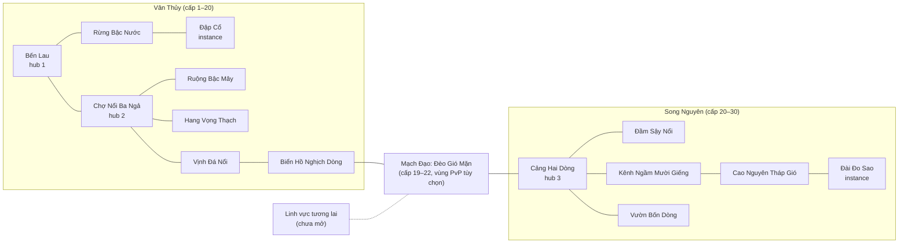

# MyVa — Thần Mạch: thế giới, linh vực và bản đồ

> Đề xuất v0.2, 2026-10-09. Mục **F** của [báo cáo thiết kế](worldbuilding-report.md). Mở rộng [World Bible §3–4](world-bible.md#3-linh-vực-và-cách-mở-rộng); không thay đổi phạm vi vertical slice.
> Cấp độ, số bản đồ và số boss là **giả thuyết phạm vi** cho MVP Online và bản ra mắt; chốt lại sau slice. Nhãn **DK / ST / ⚠** như [lineages.md](lineages.md).

## 1. Cấu trúc thế giới

- **Thần Mạch** chảy qua đất, nước, sinh vật và ký ức. Thời xa xưa nó là một **Đại Mạch**; **Cuộc Phân Dòng** chia nó thành các **linh vực** (ST, chi tiết ở [narrative.md](narrative.md#2-trả-lời-các-câu-hỏi-nền)).
- Mỗi linh vực có các **nút mạch** (nguồn nước, đỉnh núi, giếng, cây cổ thụ, kho văn bản). Nút khỏe thì vùng xung quanh tái sinh tài nguyên trong ngân sách; nút bị Hắc Triều rút thì **lệch nhịp**, có thể thành **Vùng Quên**.
- Các linh vực nối bằng **Mạch Đạo** — tuyến đi theo dòng mạch qua đèo, biển, sông. Mạch Đạo là bản đồ có thật, không phải màn hình chọn vùng.

## 2. Quy tắc kết nối linh vực

1. **Mở theo câu chuyện, không theo tiền.** Đèo Gió Mặn mở sau chương 1; Song Nguyên mở khi qua đèo. Không bán quyền mở sớm.
2. **Không khóa vĩnh viễn.** Sau khi mở, người chơi đi lại tự do giữa mọi linh vực đã phát hành. Linh vực xuất phát chỉ đổi mở đầu và cộng đồng quen biết ([World Bible §3](world-bible.md#3-linh-vực-và-cách-mở-rộng)).
3. **Đồng bộ cấp theo dải nội dung (GT).** Vào bản đồ thấp hơn, chỉ số nhân vật được hạ về trần dải + 2 cấp, vẫn giữ tương quan trang bị; phần thưởng theo bảng của dải đó. Người cấp cao chơi cùng bạn mới mà không phá thử thách.
4. **Bến Mạch.** Fast travel miễn phí trong một linh vực sau khi đã khám phá. Đi qua Mạch Đạo sang linh vực khác tốn một lượng Đồng nhỏ (sink) và một màn chuyển tải; không thanh toán bằng tiền thật.
5. **Một sổ cái tài nguyên.** Tài nguyên mỗi vùng thuộc trần toàn thế giới ([economy.md §7](economy.md#7-phân-bổ-trên-bản-đồ-kênh-và-instance)). Chuyển vùng không tạo thêm vật phẩm.
6. **Không gian chia sẻ và instance.** Hub và bản đồ mở dùng channel (giới hạn pilot 50 phiên/channel). Thử thách platform khó, boss truyện dùng instance 1–4 người. Boss thế giới dùng nhóm instance có giới hạn, không gửi toàn bộ người chơi vào một bản đồ ([architecture.md §6](../technical/architecture.md#6-giao-thức-và-reconnect)).
7. **PvP chỉ ở nơi đăng ký.** Đấu trường và Bãi Tranh Mạch trên Đèo Gió Mặn. Tuyến chính không bao giờ bắt buộc đi qua vùng PvP; luôn có đường vòng PvE.
8. **Cổng văn hóa.** Không mở linh vực có nội dung tham chiếu thực tế khi chưa đạt [quy trình duyệt văn hóa](../research/risk-register.md#4-quy-trình-duyệt-văn-hóa).

## 3. Danh mục linh vực và chọn linh vực thứ hai

### Danh mục

| Linh vực | Nhóm tham chiếu | Cảm hứng cụ thể (không phải cả châu lục) | Câu hỏi truyện | Địa hình đặc trưng | Trạng thái v0.2 | Ghi chú tên |
| --- | --- | --- | --- | --- | --- | --- |
| Vân Thủy | Đông Nam Á | Đồng bằng Mekong, núi đá vôi Bắc Bộ và vịnh, ruộng bậc thang, Biển Hồ | Ai quyết định chia nước khi nhiều cộng đồng cùng cần? | Mực nước, thủy triều, dòng đảo chiều | Slice → MVP | Giữ |
| **Song Nguyên** (đề xuất thay Sa Đăng) | Tây Á | Đồng bằng Lưỡng Hà và đầm Ahwar; qanat, vườn và tháp gió của cao nguyên Iran | Ai được tiếp cận đường đi và công cụ đo mạch? (giữ từ v0.1) | Dòng ngầm, gió, đảo sậy | Bản ra mắt 1.0 | Đổi tên, xem dưới |
| Thiên Kính | Đông Á | Núi đá, đồng bằng, trung tâm học thuật | Làm sao giữ tri thức sống khi các trường phái chỉ tin bản chép của mình? | Cột đá dọc, sương | Mở rộng | Giữ; tránh gợi bảo vật gương hoàng gia |
| Sương Hải | Bắc Âu | Vịnh hẹp, quần đảo, nhà dài, nơi họp hội đồng | Một lời thề còn nghĩa gì khi điều kiện sống đã đổi? | Băng, biển, sông băng | Mở rộng (ứng viên linh vực 3) | Giữ |
| (chưa đặt tên) | Nam Á | Chọn cộng đồng cụ thể cùng cố vấn | Đề xuất: khi nhiều cộng đồng cùng tôn kính một dòng sông, ai có quyền nắn nó? | Gió mùa, giếng bậc thang | Nghiên cứu; ứng viên linh vực 3 nếu có cố vấn | Đặt tên khi vào nghiên cứu sâu |
| Nhật Lâm | Nam Mỹ | Andes, đường núi, rừng ngập | Làm sao kết nối các cộng đồng mà không ép họ bỏ quyền tự quản? | Đường dốc, cầu dây | Nghiên cứu | Giữ |
| Thạch Phong | Bắc Mỹ | Chỉ khi có đối tác bản địa | Một liên minh bảo vệ đất ra quyết định chung bằng cách nào? | — | Nghiên cứu | Đổi tên: trùng hình vị với Phong Vũ, Sơn Cốt |
| Hồng Nguyên | Australia | Chỉ khi có đối tác bản địa | Làm sao cư trú và đi lại mà vẫn tôn trọng quyền gìn giữ từng nơi? | — | Nghiên cứu | Đổi tên: gợi khuôn mẫu "vùng đỏ" |
| (chưa đặt tên) | Châu Phi cận Sahara | Chọn cộng đồng cụ thể cùng cố vấn | Đề xuất: ký ức giữ bằng lời có giá trị bằng văn bản không? | Châu thổ nội địa, thác | Nghiên cứu | — |
| (chưa đặt tên) | Thái Bình Dương | Chỉ khi có đối tác | — | Biển, điều hướng bằng sao | Nghiên cứu | — |

Các linh vực "chưa đặt tên" cố ý để trống: đặt tên trước khi nghiên cứu là tạo tên rỗng nghĩa.

### Chọn linh vực thứ hai cho bản ra mắt

Chấm 1–5 (5 tốt nhất); điểm là đánh giá định tính:

| Tiêu chí | Song Nguyên (Lưỡng Hà–Iran) | Thiên Kính (Đông Á) | Sương Hải (Bắc Âu) | Linh vực Nam Á |
| --- | ---: | ---: | ---: | ---: |
| Nối tiếp chủ đề nước và ký ức của Vân Thủy | 5 — qanat, đầm, Bảng Định Mệnh | 4 — Vũ trị thủy | 3 — giếng Mímir, Sampo | 5 — dòng văn hóa Ấn → Đông Nam Á, Vritra giữ nước |
| Tương phản hình ảnh và địa hình | 5 | 3 | 5 | 4 |
| Rủi ro văn hóa (5 = thấp) | 3 | 3 | 4 | 1 |
| Khác biệt trên thị trường | 4 | 2 | 1 | 4 |
| Tái sử dụng asset từ Vân Thủy (5 = nhiều) | 2 | 4 | 2 | 3 |
| Nguồn nghiên cứu sẵn có | 4 | 5 | 5 | 4 |
| **Tổng** | **23** | 21 | 20 | 21 |

**Đề xuất: Song Nguyên.** Nó nối trực tiếp phản diện (Người Đo Mạch, Mạch Bạ) với một mô-típ có nguồn (Bảng Định Mệnh), đổi khủng hoảng từ "chia nước" sang "quyền tiếp cận và đo đạc", và tạo tương phản hình ảnh mạnh. Thần thoại Lưỡng Hà cổ không còn được thờ phụng rộng rãi, nên rủi ro thấp hơn dùng thần Hindu, nhưng vẫn có ⚠ với cộng đồng đầm lầy, người Assyria và nguy cơ Đông phương học.

Nếu đầu tư sớm được cố vấn Nam Á, linh vực Nam Á là ứng viên mạnh cho linh vực thứ ba.

### Đổi tên "Sa Đăng"

"Sa" (cát) + "Đăng" (đèn) gợi đúng hai khuôn mẫu World Bible muốn tránh: đồng nhất khu vực với sa mạc, và đèn thần Aladdin — một truyện được Galland thêm vào ở châu Âu thế kỷ 18 ([khảo sát §11](../research/mythology-survey.md#11-thần-thoại-gốc-và-chuyển-thể-hiện-đại)).

| Phương án | Nghĩa | Đánh giá |
| --- | --- | --- |
| **Song Nguyên** | Hai nguồn — gợi vùng giữa hai sông và hai lối giữ ký ức (văn bản và lời kể) | Đề xuất. Phiên âm quốc tế: *Song Nguyen* |
| Trắc Nguyên | Đo nguồn ("trắc" như trắc địa) | Gắn chặt với phản diện; âm "trắc" hơi gắt |
| Giữ Sa Đăng | — | Mâu thuẫn chính World Bible |

## 4. Vân Thủy

**Cảm hứng (DK):** đồng bằng và chợ nổi Mekong; Biển Hồ Tonlé Sap đảo chiều mỗi mùa lũ [S6][S7]; núi đá vôi Hạ Long và hệ hang Phong Nha–Kẻ Bàng [S8]; ruộng bậc thang và đền chia nước subak [S5] (trong [khảo sát](../research/mythology-survey.md#13-nguồn-tham-khảo)). Vân Thủy là **hư cấu** và không đại diện toàn bộ Đông Nam Á.

**Bản sắc hình ảnh:** xanh lục và nâu phù sa; mái lá, tre, gỗ; đỏ gạch của di tích; ánh đèn trên mặt nước. Cảnh nền thay đổi theo mực nước.

**Khủng hoảng:** Hắc Triều chiếm các công trình điều tiết, chuyển nước và mạch về các Trạm Rút Mạch. Người thượng nguồn sợ lũ, người hạ nguồn thiếu nước.

**Địch thường (8 archetype, 3 dùng ở slice):**

| Archetype | Nhóm | Hành vi đọc được | Dạy kỹ năng gì |
| --- | --- | --- | --- |
| Lính Gác Hắc Triều | Người | Khiên phía trước, đâm hai nhịp | Đánh vòng, phá thủ |
| Xạ Thủ Nỏ | Người | Đạn chậm theo nhịp | Đỡ, lướt, phản đạn |
| Thợ Máy + Ống Dò Mạch | Máy | Cắm ống tạo vùng nguy hiểm | Đọc địa hình, ưu tiên mục tiêu |
| Cá Quẫy | Lệch nhịp | Nhảy khỏi nước theo sóng | Canh nhịp, đánh trên không |
| Khỉ Đá | Lệch nhịp | Ném đá từ trên cao | Leo tầng, chọn đường |
| Cua Vỏ Đá | Lệch nhịp | Giáp phía trước, chậm | Đánh sau lưng, đòn nặng |
| Đom Đóm Quên | Lệch nhịp | Bầy nhỏ; làm mờ ký hiệu nhiệm vụ (không che telegraph) | Giữ định hướng, diệt bầy |
| Rắn Nước Non | Lệch nhịp | Phun đạn vòng cung | Né theo quỹ đạo |

Ba archetype của slice là Lính Gác, Xạ Thủ Nỏ, Ống Dò Mạch, khớp [vertical-slice](../production/vertical-slice.md#phạm-vi). Mọi kẻ địch người dùng chung một rig người, đổi trang phục và vũ khí.

### 4.1 Bến Lau — hub 1 (đã có trong slice)

- **Cảm hứng:** làng bến sông có nhà sàn và cột mốc nước. **Vị trí:** nhánh sông dưới Đập Cổ.
- **Cấp:** 1–3. **Không gian:** hub chia sẻ, an toàn.
- **Nội dung:** NPC chính (Mai, An, Tùng; thêm Ngàn và Nguyệt ở bản ra mắt), sân tập năm truyền thừa, điểm hồi sinh, bàn chế tạo.
- **Tài nguyên:** không khai thác; nhận gói khởi đầu.
- **Bí mật:** cột mốc nước khắc vạch lũ các năm (Hồi Ức đầu tiên); vọng ảnh dưới gầm nhà sàn chỉ thấy khi có Mạch tính Ký.

### 4.2 Rừng Bậc Nước (đã có trong slice)

- **Cảm hứng:** suối chảy qua bậc đá trong rừng nhiệt đới. **Cấp:** 4–6. **Không gian:** bản đồ mở.
- **Hình ảnh:** thác nhiều tầng, đá phủ rêu, cây ngả ngang suối.
- **Địch:** Lính Gác, Xạ Thủ Nỏ, Khỉ Đá. **Boss:** không.
- **Tài nguyên:** Linh thảo (2 cụm điểm), Mạch khoáng (1 cụm).
- **Địa hình:** thác tạo màn che đạn; đá ướt cuối thác trượt nhẹ khi dừng (có tín hiệu bóng nước); tuyến platform ngắn luôn có đường vòng dễ.
- **Nhiệm vụ, bí mật:** "Linh kiện còn thiếu" và "Dấu chuyển dòng" của slice; trại thợ săn của Ngàn (đạo trường Lâm Trảo) trên cây; dây leo mọc bằng Mạch tính Sinh dẫn tới hốc Hồi Ức.

### 4.3 Đập Cổ — instance (đã có trong slice)

- **Cấp:** 7–10. **Không gian:** instance 1–4 người.
- **Boss:** Kẻ Giữ Đập ([combat.md §9](combat.md#9-boss-kẻ-giữ-đập)). Đề xuất bổ sung truyện: Kẻ Giữ Đập là học trò cũ của An (ST).
- **Địa hình:** nước dâng một phần nền theo pha; van mở cửa phản công.
- **Bí mật:** mỏ đá cũ cạnh đập là đạo trường Sơn Cốt; thiết bị đo lạ trong phòng điều khiển — bí ẩn đầu tiên về Người Đo Mạch.

### 4.4 Chợ Nổi Ba Ngả — hub 2

- **Cảm hứng (DK):** chợ nổi ở ngã ba sông của đồng bằng Mekong và các chợ nổi Đông Nam Á khác. **Vị trí:** hợp lưu ba nhánh, hạ nguồn Bến Lau.
- **Cấp:** 10–12. **Không gian:** hub chia sẻ + khu nhiệm vụ mở.
- **Hình ảnh:** ghe thuyền buộc thành dãy, cây bẹo treo hàng, nhà nổi, cầu tạm giữa ghe.
- **Nội dung:** hội đồng Liên Bến; quầy Thương Hội Mạch Đạo (giao dịch giới hạn ở MVP); **Võ Đài Thuyền** (đấu trường).
- **Địch, boss:** Rắn Nước Non, Cá Quẫy ở khu ngoài chợ; elite **Thuồng Luồng Mắc Lưới** — dùng lại rig Giao Ngược thu nhỏ; kết thúc bằng gỡ lưới và trả nhịp.
- **Tài nguyên:** không khai thác trong chợ; thu mua NPC có ngân sách hữu hạn ([economy.md §9](economy.md#9-tiền-tệ-và-thị-trường)).
- **Địa hình:** ghe là nền trôi chậm theo dòng; nước giữa ghe làm chậm và không cho đỡ.
- **Nhiệm vụ, bí mật:** tranh chấp giá nước giữa các bến (giới thiệu hệ thống chia nước); một ghe hàng chở mảnh Mạch Bạ bị buôn lậu (Én Đen).

### 4.5 Ruộng Bậc Mây

- **Cảm hứng (DK):** ruộng bậc thang vùng cao và mạng lưới đền chia nước kiểu subak [S5]. ⚠ không tái hiện nghi lễ hay kiến trúc đền Bali; đền chia nước của MyVa là thiết kế mới.
- **Cấp:** 11–14. **Không gian:** bản đồ mở dọc nhiều tầng.
- **Hình ảnh:** ruộng bậc phản chiếu mây, cối xay gió trên gò (đạo trường Phong Vũ), mương nước nối bậc.
- **Địch, boss:** Lính Gác, Thợ Máy, Cua Vỏ Đá; boss **Đốc Kè** (instance nhỏ) — kỹ sư Hắc Triều dùng Sơn Cốt dựng tường chặn dòng; trận chia ba pha theo ba tầng ruộng.
- **Tài nguyên:** Linh thảo (nhiều), Mạch khoáng (ít, ở bờ đá).
- **Địa hình:** cửa cống đổi mực nước từng bậc: bậc ngập thành bùn (chậm 15%), bậc cạn thành nền cứng. Đóng cống ở trên làm ngập bậc dưới — người chơi thấy hậu quả cho người khác.
- **Nhiệm vụ, bí mật:** câu đố **Đền Chia Nước**: chia nước cho ba thôn theo lịch, không có đáp án "ai cũng được hết" (lựa chọn có hệ quả, [narrative.md §5](narrative.md#5-lựa-chọn-và-hệ-quả)); luồng khí bốc lên ở gò cho Phong Vũ lên tổ chim (Hồi Ức).

### 4.6 Hang Vọng Thạch

- **Cảm hứng (DK):** hệ hang đá vôi khổng lồ có sông ngầm và giếng trời như Phong Nha–Kẻ Bàng [S8].
- **Cấp:** 13–16. **Không gian:** bản đồ mở + instance boss.
- **Hình ảnh:** cột nhũ đá, giếng trời rọi sáng, rừng trong hố sụt, vách khắc vọng ảnh.
- **Địch, boss:** Khỉ Đá, Đom Đóm Quên, Rắn Nước Non; boss **Hổ Mất Nhịp** ⚠ ở khu rừng hố sụt — trận kết thúc bằng trả nhịp (Lâm Trảo nhận nhiệm vụ riêng).
- **Tài nguyên:** Mạch khoáng (nhiều), Linh thảo (ở hố sụt).
- **Địa hình:** ngoài vùng giếng trời tầm nhìn giảm, nhưng telegraph luôn sáng; sông ngầm đẩy người theo dòng; nhũ đá làm nền có thể phá.
- **Nhiệm vụ, bí mật:** đạo trường Tơ Vọng; vọng ảnh kể Cuộc Phân Dòng — bí ẩn về Đại Mạch; Nguyệt xuất hiện ở MVP (ở bản ra mắt, Nguyệt đã ở Bến Lau).

### 4.7 Vịnh Đá Nổi

- **Cảm hứng (DK):** vịnh núi đá vôi trên biển như Hạ Long. **Cấp:** 15–18. **Không gian:** bản đồ mở.
- **Hình ảnh:** đảo đá dựng, hang xuyên đảo, làng chài nổi, rừng ngập mặn.
- **Địch, boss:** Cá Quẫy, Xạ Thủ Nỏ, Cua Vỏ Đá; boss **Én Đen** trên vách đá (rig người, chiến đấu kiểu Phong Vũ).
- **Tài nguyên:** Linh thảo (rừng ngập mặn), Mạch khoáng (hang).
- **Địa hình:** thủy triều chu kỳ ~4 phút (GT) làm doi cát lộ hoặc chìm; đồng hồ triều hiển thị rõ; hang chỉ vào được lúc triều thấp.
- **Nhiệm vụ, bí mật:** truy đường buôn mảnh Mạch Bạ; hang triều thấp chứa Hồi Ức về Hắc Triều thời đầu.

### 4.8 Biển Hồ Nghịch Dòng — kết chương 1

- **Cảm hứng (DK):** Biển Hồ Tonlé Sap — sông đổi chiều chảy vào hồ khi Mekong dâng; dòng chảy ngược đang yếu đi vì thay đổi lòng sông và công trình thượng nguồn [S6][S7]. ⚠ không dùng tên đập, nước hay công trình có thật.
- **Cấp:** 18–20. **Không gian:** bản đồ mở + instance kết chương + boss thế giới.
- **Hình ảnh:** mặt hồ mênh mông, nhà nổi, rừng ngập, Trạm Rút Mạch bằng kim loại đen giữa hồ.
- **Boss:** instance **Bánh Xe Ngược** (cỗ máy ép dòng chảy ngược sai mùa); boss thế giới **Giao Ngược** (giao long bị máy xoắn mạch, theo lịch, nhóm instance có giới hạn).
- **Tài nguyên:** cả hai loại thường; Mảnh Thần Mạch chỉ qua sự kiện có ngân sách.
- **Địa hình:** dòng chảy đổi chiều theo pha, đẩy ngang người và đạn; telegraph đổi chiều ≥ 1.000 ms (GT).
- **Nhiệm vụ, bí mật:** giải phóng hồ; tìm thấy mảnh Mạch Bạ có chữ Song Nguyên; lời mời của Hội Giữ Nhịp.

## 5. Mạch Đạo: Đèo Gió Mặn

- **Cảm hứng:** đèo núi ven biển trên tuyến buôn muối và hàng; mạng đường có trạm nghỉ như Qhapaq Ñan (cảm hứng cấu trúc, mức 2).
- **Cấp:** 19–22. **Không gian:** bản đồ mở nối hai linh vực; một phần là **Bãi Tranh Mạch** (PvP tùy chọn).
- **Hình ảnh:** vách đá trắng muối, cờ gió, trạm nghỉ của Thương Hội, đoàn xe.
- **Địch, boss:** Lính Gác, Thợ Máy; **Tượng Gác Đèo** — thử thách Sơn Cốt, không phải kẻ thù.
- **Địa hình:** gió ngang theo cơn, có tín hiệu cờ trước 1 s; đẩy người và đạn nhẹ.
- **Nhiệm vụ:** hộ tống đoàn xe (nhiệm vụ PvE), mở tuyến tiếp tế đầu tiên — nền cho Chiến dịch Tiếp Mạch mùa 1.

## 6. Song Nguyên

**Cảm hứng (DK):** đồng bằng Tigris–Euphrates và đầm Ahwar cạnh di chỉ Uruk, Ur, Eridu [S21]; qanat dẫn nước ngầm có giếng đứng, hồ chứa, cối nước [S20]; vườn Ba Tư bốn phần; tháp gió; chim Simurgh và Anzû [S19][S22]. Song Nguyên là **hư cấu**, không đại diện Iraq, Iran hay "Trung Đông".

**Bản sắc hình ảnh:** gạch nung vàng nâu, ngói men lam, lau sậy xanh bạc, nước xanh trong kênh, gió và bóng mát. **Tránh:** sa mạc vô tận, đèn thần, nhân vật phản diện ăn mặc theo một dân tộc.

**Khủng hoảng:** Nhà Bảng giữ bản đồ và công cụ đo mạch. Người Đo Mạch dùng chúng để quyết định ai được nước, đường đi và quyền đọc văn bản.

**Địch thường (+6 archetype):** Lính Gác Bảng (đọc bảng tăng giáp đồng đội — ưu tiên hạ trước), Thợ Đo (đặt lưới đo làm chậm), Cò Sậy (lao mỏ từ bụi sậy, có bóng báo), Dơi Giếng (bầy trong kênh ngầm), Bọ Muối (trồi lên từ nền muối), Lốc Cát (xoáy bụi di chuyển, đẩy). Lính Gác Bảng và Thợ Đo dùng lại rig người.

**Tượng canh có cánh** (cảm hứng lamassu ⚠) chỉ xuất hiện như **đồng minh và cơ quan**, không làm kẻ thù.

### 6.1 Cảng Hai Dòng — hub 3

- **Cấp:** 20–22. **Không gian:** hub chia sẻ.
- **Hình ảnh:** cảng sông ở hợp lưu, chợ có mái vòm, tòa Nhà Bảng với kệ bảng đất sét và cuộn giấy.
- **Nội dung:** Nhà Bảng (thế lực); đạo trường Tơ Vọng; trạm Thương Hội; mentor truyền thừa phụ.
- **Bí mật:** phòng lưu trữ đóng kín — mảnh Mạch Bạ đầu tiên được đọc (bí ẩn trung tâm).

### 6.2 Đầm Sậy Nổi

- **Cảm hứng (DK):** đầm lầy nội địa có đảo sậy và nhà sậy [S21]. ⚠ cộng đồng người đầm lầy đang sống; làng sậy của MyVa là cộng đồng hư cấu, được thể hiện có phẩm giá, không "nguyên thủy".
- **Cấp:** 21–24. **Không gian:** bản đồ mở + instance boss.
- **Địch, boss:** Cò Sậy, Thợ Đo, Lính Gác Bảng; boss **Máy Hút Đầm** — cỗ máy rút nước làm khô đầm (⚠ gợi lịch sử tháo khô đầm có thật; xử lý không chính trị hóa, không nêu tên thật).
- **Tài nguyên:** **Sợi Lau** (mới), Linh thảo.
- **Địa hình:** đảo sậy chìm dần nếu đứng quá 3 s (GT, có tín hiệu nước dâng); thuyền nhỏ; sậy cao che tầm nhìn ngang nhưng không che telegraph.
- **Nhiệm vụ:** cứu làng sậy khỏi bị tháo khô; lựa chọn chia lại nước cho đầm hay cho ruộng hạ lưu.

### 6.3 Kênh Ngầm Mười Giếng

- **Cảm hứng (DK):** qanat — đường hầm nghiêng dẫn nước ngầm, giếng đứng thông gió, cộng đồng chia nước theo lượt [S20].
- **Cấp:** 23–26. **Không gian:** dungeon mở chia đoạn.
- **Địch, boss:** Dơi Giếng, Bọ Muối; boss **Người Giữ Kênh Hóa Tướng** — người giữ kênh dẫn mạch quá ngưỡng, thành hiện thân dòng nước (rig người + VFX).
- **Tài nguyên:** Mạch khoáng.
- **Địa hình:** hầm hẹp hạn chế đòn quét rộng; giếng đứng là đường leo và luồng gió; dòng nước trong kênh đẩy theo một chiều.
- **Nhiệm vụ, bí mật:** khôi phục lịch chia nước theo lượt; Hồi Ức về Người Đo Mạch thời còn là học trò Nhà Bảng.

### 6.4 Vườn Bốn Dòng

- **Cảm hứng (DK):** vườn Ba Tư chia bốn phần bởi kênh nước, có tường bao.
- **Cấp:** 25–27. **Không gian:** bản đồ mở + instance boss.
- **Địch, boss:** Lính Gác Bảng, Lốc Cát; boss **Vườn Chủ Khô Héo** — linh hồn khu vườn bị cắt nước, trận kết thúc bằng trả nhịp.
- **Tài nguyên:** Linh thảo, Sợi Lau.
- **Địa hình:** kênh hình học chia khu; đài phun là bệ bật lên (dùng được khi kênh có nước); tường vườn chặn đạn.
- **Nhiệm vụ:** mở lại bốn kênh theo thứ tự hợp lý; Mạch tính Sinh làm sống lại góc vườn bí mật.

### 6.5 Cao Nguyên Tháp Gió

- **Cảm hứng (DK):** tháp hút gió và vùng muối của cao nguyên Iran.
- **Cấp:** 26–29. **Không gian:** bản đồ mở + boss thế giới.
- **Địch, boss:** Bọ Muối, Lốc Cát, Thợ Đo; boss thế giới **Chim Bão Giữ Bảng** — cảm hứng Anzû: chim bão cướp một mảnh Mạch Bạ và giữ nó trên đỉnh tháp.
- **Tài nguyên:** **Muối Mạch** (mới), Mạch khoáng.
- **Địa hình:** gió theo cơn (có cờ báo), nền muối phản chiếu, bão bụi giảm tầm nhìn nền nhưng giữ telegraph.
- **Nhiệm vụ:** đưa tháp gió hoạt động lại để hạ nhiệt làng; trinh sát đường lên Đài Đo Sao.

### 6.6 Đài Đo Sao — kết chương 2

- **Cảm hứng:** đài quan sát nhiều tầng kiểu ziggurat và dụng cụ thiên văn cổ (thiết kế mới, mức 2).
- **Cấp:** 28–30. **Không gian:** instance 1–4 người.
- **Boss:** **Kẻ Chép Câm** (cỗ máy xóa ký ức, ghi đè tiếng vọng của người chơi); pha cuối là hình chiếu của **Người Đo Mạch** — không thể đánh bại ở chương này.
- **Địa hình:** bệ xoay như vòng thiên văn; tầng bậc; Vùng Quên làm mất ký hiệu bản đồ trong instance.
- **Kết quả:** mảnh Mạch Bạ bị lấy đi hoặc được giữ tùy kết quả mùa chiến dịch ở server (chỉ đổi câu thoại và Biên Niên, không đổi hình học).

## 7. Khu vực PvP và chiến dịch

| Khu vực | Loại | Luật | Phần thưởng |
| --- | --- | --- | --- |
| Võ Đài Thuyền (Chợ Nổi) | Đấu tay đôi, 2v2, 3v3 | Chỉ số chuẩn hóa ([combat.md §13](combat.md#13-chỉ-số-pvp-và-nghiệm-thu)); không vật phẩm hồi | Danh hiệu, mỹ phẩm; không tiền tệ farm được |
| Bãi Tranh Mạch (Đèo Gió Mặn) | PvP thế giới tùy chọn | Bật cờ khi vào; nén chênh lệch trang bị (GT); không mất đồ | Điểm chiến dịch, danh vọng |
| Mặt trận chiến dịch | Nhóm instance theo lịch | PvE trước; mặt trận PvP là nhánh tùy chọn | Theo trần chung, không bonus vĩnh viễn ([progression-social.md §8](progression-social.md#8-chiến-dịch-liên-lục-địa-và-mùa)) |

## 8. Quy chuẩn dựng bản đồ

Áp dụng cho mọi bản đồ mới (GT, chỉnh sau slice):

- **Kích thước:** khu mở 3–6 màn hình ngang, 1–3 tầng; hub ≤ 4 màn hình. Đi bộ giữa hai điểm nhiệm vụ ≤ 60 s.
- **Đường chính** không đòi bộ pháp hay Mạch tính riêng. Mỗi Mạch tính có mặt trong bản đồ mở ít nhất một đường phụ hoặc bí mật.
- **Địa hình chiến đấu:** ít nhất một yếu tố ảnh hưởng chiến đấu, có tín hiệu bằng hình + âm thanh, không chỉ màu.
- **Bí mật:** ≥ 2 mỗi bản đồ mở (Hồi Ức, đường tắt, vọng ảnh).
- **Platform chính xác:** tối đa một đoạn ở bản đồ mở, luôn có đường vòng; đoạn khó đặt trong instance.
- **Boss:** nền chính rộng, ≥ 2 cách mở điểm lệch dùng hành động chung (đòn nặng, phá thủ, van/cơ quan) để truyền thừa nào cũng xử lý được; luật pha như [combat.md §9](combat.md#9-boss-kẻ-giữ-đập).
- **Quái:** ≤ 3 archetype mới mỗi bản đồ; mỗi archetype dạy một kỹ năng.
- **Tái sử dụng:** mỗi linh vực một bộ tile + 4 lớp parallax; mỗi bản đồ thêm ≤ 30% asset riêng (GT). Boss người dùng rig người; boss sinh vật là chi phí lớn nhất, giới hạn số lượng.
- **Mobile:** HUD và nút không che vùng nguy hiểm; camera không zoom ra quá mức làm telegraph nhỏ hơn ngưỡng đọc ở [assets-performance.md](../technical/assets-performance.md).

## 9. Linh vực tương lai

Mỗi linh vực mới cần: một xung đột riêng, một yếu tố địa hình làm đổi lối chơi, ít nhất một boss đọc pattern, một nhánh địa phương cho truyền thừa có sẵn, và hồ sơ duyệt văn hóa ([roadmap](../production/roadmap.md#mở-rộng-thế-giới)). Thứ tự đề xuất sau bản ra mắt: Sương Hải (rủi ro thấp) hoặc linh vực Nam Á (nếu có cố vấn); các linh vực Bắc Mỹ, Australia, Thái Bình Dương, châu Phi chỉ bắt đầu khi có đối tác sáng tạo từ cộng đồng.
