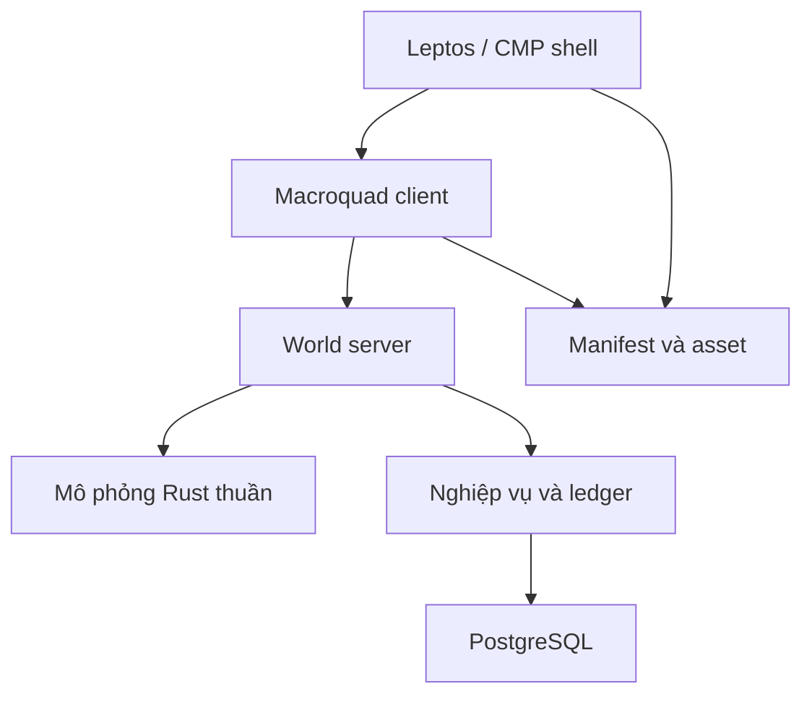

# Kiến trúc kỹ thuật — MyVa · Thần Mạch

**Trạng thái:** đề xuất thiết kế v0.1, ngày 09/10/2026. Repository hiện chứa tài liệu; các module, giao thức và chỉ số dưới đây chưa được triển khai hoặc đo kiểm.

## 1. Quyết định và giới hạn

| Nội dung | Trạng thái |
| --- | --- |
| Gameplay và renderer Rust + Macroquad | Đã chọn theo yêu cầu sản phẩm |
| Web shell Leptos; mobile shell Kotlin Compose Multiplatform | Đã chọn |
| Mobile dùng renderer native, không phụ thuộc WebView | Đích kiến trúc; phải vượt qua prototype Android và iOS |
| Online server authoritative | Bắt buộc với vị trí hợp lệ, chiến đấu, phần thưởng, giao dịch và tài nguyên |
| Backend Rust, Axum/Tokio, PostgreSQL | Đề xuất để làm MVP, chưa chốt phiên bản thư viện |
| Một backend module hóa trước, tách dịch vụ sau bằng số liệu | Đề xuất để giảm vận hành và giao dịch phân tán |
| 60 tick/giây, snapshot khoảng 20 lần/giây | Giả thuyết hiệu năng, phải qua load test |

Macroquad có target HTML5, Android và iOS trong tài liệu chính thức [S1–S2]. Điều này xác nhận khả năng xây game độc lập trên các target, chưa xác nhận renderer có thể nhúng trực tiếp vào view CMP với đầy đủ lifecycle.

## 2. Phân chia trách nhiệm

Các tên bên dưới là **vai trò logic**, không phải danh sách crate đang tồn tại.

| Thành phần | Sở hữu | Không sở hữu |
| --- | --- | --- |
| Mô phỏng Rust thuần | Luật di chuyển, collision, combat, cooldown, RNG có seed, AI | Window, texture, audio, truy cập DB |
| Client gameplay Macroquad | Input, prediction, render, animation, VFX, âm thanh gameplay | Phát thưởng, định giá, phát hành tài nguyên |
| Shell Leptos/CMP | Login, chọn nhân vật, tải nội dung, IME, navigation, thiết lập | Tự sửa trạng thái chiến đấu hoặc túi đồ |
| Server world | Phiên chơi, bản đồ, tick authoritative, kiểm tra command, interest management | Render đồ họa |
| Server nghiệp vụ | Nhân vật, inventory, nhiệm vụ, bang hội, ledger, giao dịch | Tin kết quả do client tự báo |
| PostgreSQL | Trạng thái bền vững, unique constraint, transaction, outbox | Lưu mọi frame render hoặc mọi snapshot mạng |
| Kho asset/CDN | Nội dung đã build, manifest theo phiên bản | Lệnh gameplay hoặc logic kinh tế có quyền thực thi |

Simulation có API nhận trạng thái, command hợp lệ và thời gian tick rồi trả trạng thái cùng sự kiện. Client và server dùng chung quy tắc, nhưng chỉ server có quyền quyết định sự kiện được chấp nhận.

## 3. Web: tách shell và game runtime

Leptos SSR/hydration sử dụng bản build server và bản WASM cho trình duyệt [S3]. Macroquad có loader và vòng lặp riêng [S1]. **Không giả định hai framework cùng build thành một WASM bằng cách thêm dependency.**

Đường thử nghiệm ưu tiên:

1. Leptos hiển thị login, chọn vùng, tải nội dung và trạng thái lỗi.
2. Sau khi DOM/canvas đã sẵn sàng, shell khởi tạo loader Macroquad đúng một lần.
3. Game WASM và shell WASM tách bundle; bridge JS nhỏ trao đổi command/event có version.
4. Bridge truyền token phiên ngắn hạn theo hợp đồng; không đưa token vào URL hoặc manifest.
5. Game giữ ownership canvas và render loop; Leptos giữ DOM ngoài canvas.
6. Rời game phải đóng network, hủy listener, giải phóng handle; nếu runtime không hỗ trợ teardown an toàn, chuyển sang game route/document riêng cùng origin trong prototype.

Cần đo thêm: load hai WASM, clipboard, audio cần thao tác người dùng, fullscreen, focus bàn phím, zoom/DPR, resize, WebGL context loss và browser tab nền. Game không block vòng lặp trình duyệt bằng I/O đồng bộ.

Bridge không chuyển toàn bộ thế giới qua JSON mỗi frame. Gửi sự kiện shell thưa, còn gameplay/network ở trong runtime game; dùng buffer có giới hạn nếu cần trao đổi input native.

## 4. Mobile: feasibility gate trước khi cam kết sản xuất

Android Compose có `AndroidView`; CMP iOS có `UIKitView` để chứa native view [S4–S5]. Đây là điểm gắn UI **có thể nghiên cứu**, không phải adapter Macroquad đã có sẵn.

Prototype phải kiểm chứng khả năng tách/quản lý vòng lặp và native surface của Macroquad/miniquad, thay vì để hai runtime tranh ownership Activity, view, graphics context hoặc main thread.

| Hạng mục prototype | Bằng chứng cần có |
| --- | --- |
| Android | Rust library được gọi qua JNI/C ABI; native surface nằm trong CMP; kiểm tra surface mất/tạo lại |
| iOS | Rust library được link trong app; native view/controller chứa renderer; kiểm tra backend đồ họa và thread thực tế |
| Lifecycle | Vào/rời game 30 lần; background/resume 20 lần; resize/orientation; không crash, không giữ resource cũ |
| Input | Multi-touch, hủy touch, gamepad/keyboard nếu hỗ trợ; chuyển focus giữa game và shell đúng |
| IME | Chat tiếng Việt do shell quản lý; mở bàn phím không làm người chơi tự di chuyển hoặc đánh |
| Audio | Một owner cho audio gameplay; xử lý interruption, tai nghe, mute, resume |
| Hiệu năng | Profile render native và overlay CMP; không copy CPU toàn màn hình mỗi frame |
| Đóng gói | Chạy trên thiết bị Android/iPhone thật và build release có signing hợp lệ |

Hợp đồng adapter dự kiến: `create`, `resize`, `pause`, `resume`, `enqueue_input`, `poll_events`, `destroy`. Chưa chốt ABI, allocator hay cơ chế ownership; FFI phải dùng handle, mã lỗi và bộ nhớ có quy tắc giải phóng rõ ràng.

Nếu embedding cần sửa miniquad sâu hoặc không đạt lifecycle, ghi ADR với chi phí và lựa chọn: màn native độc lập do CMP điều hướng là phương án nghiên cứu đầu tiên. Không tự đổi sản phẩm sang WebView hoặc engine khác. Chưa vượt gate thì chưa công bố mobile đã hỗ trợ.

## 5. Tick, prediction và chiến đấu online

- Fixed step là ứng viên 60 Hz; render có thể chạy 60 FPS hoặc hạ 30 FPS mà không đổi tốc độ luật.
- Thời gian startup/active/recovery và cooldown biểu diễn bằng tick; stamina, tiền và số lượng vật phẩm dùng số nguyên.
- Không mặc định float cho kết quả bit-identical giữa native và WASM. Prototype so sánh replay; lượng hóa vị trí/va chạm hoặc chọn fixed-point cho phần cần tái lập sau khi đo sai lệch, overflow và chi phí.
- Server là nguồn đúng cuối cùng ngay cả khi client và server cùng dùng mã Rust.
- Client dự đoán di chuyển và phản hồi animation của chính mình; snapshot trả tick cùng input sequence đã xử lý để reconciliation.
- Nhân vật khác dùng interpolation; hạn chế extrapolation khi mất gói. HP, drop và inventory chỉ hiển thị chắc chắn sau xác nhận.
- Damage kiểm tra vị trí, trạng thái, resource, cooldown và mục tiêu trên server; không nhận lệnh “tôi gây X damage”.
- Tránh rollback vô hạn: giới hạn lịch sử, cửa sổ input và bù trễ; giới hạn cụ thể cần playtest độ công bằng giữa người né và người đánh.

MMORPG không đồng nghĩa trận đối kháng đạt cảm giác giống game local ở mọi độ trễ. Pilot kiểm tra RTT 50/100/150/250 ms, jitter và mất gói; nếu phản đòn ngắn không công bằng thì tăng telegraph/window hoặc giới hạn chế độ thi đấu theo chất lượng kết nối.

## 6. Giao thức và reconnect

MVP đề xuất WebSocket qua TLS để đồng nhất web/native, kết hợp HTTPS cho login và nội dung. Đây là điểm bắt đầu; phải đo head-of-line blocking trước khi cân nhắc transport khác.

Envelope có `protocol_version`, `session_epoch`, `sequence`, `server_tick` và payload có schema. Giới hạn kích thước, tốc độ message, độ sâu decode và thời gian xử lý; server từ chối version không tương thích.

Command gameplay là ý định: hướng di chuyển, jump, guard, skill và interaction. Mọi command bị kiểm tra quyền phiên, trạng thái nhân vật, tốc độ và cửa sổ tick.

Reconnect phát session epoch mới, vô hiệu command cũ và lấy snapshot đầy đủ; chỉ phát lại input chưa được ack nằm trong cửa sổ cho phép. Không phát lại giao dịch kinh tế bằng input combat; giao dịch dùng operation ID riêng để đọc kết quả hoặc retry an toàn.

Interest management gửi entity/sự kiện trong khu vực quan tâm. World boss và chiến dịch dùng nhóm instance có giới hạn; không gửi mọi entity toàn lục địa cho mỗi người chơi.

## 7. Dữ liệu bền vững và kinh tế

Tách dữ liệu tạm của combat khỏi dữ liệu sở hữu. Position/snapshot có thể được checkpoint theo ngân sách; vật phẩm, tiền, quest reward và phát hành tài nguyên phải có transaction bền vững.

| Nghiệp vụ | Quy tắc đề xuất |
| --- | --- |
| Nhặt vật phẩm | Drop ID và recipient; consume drop + cộng inventory một lần trong transaction |
| Quest reward | Unique key nhân vật/quest/reward; retry trả kết quả đã lưu |
| Giao dịch | Operation ID; kiểm tra số dư và ownership; debit/credit nguyên tử, khóa theo thứ tự ổn định |
| Craft/sửa chữa | Trừ nguyên liệu/tiền và tạo kết quả trong cùng transaction |
| Tài nguyên tái sinh | Ledger phát hành/thu hoạch/tiêu hao với budget khu vực; không dựa vào clock client |
| Thông báo ra world | Outbox commit cùng nghiệp vụ; consumer chống trùng theo event ID |

Crash sau commit nhưng trước phản hồi không được nhân đôi vật phẩm. Crash trước commit không được phát phần thưởng “đã thành công”. Command kinh tế chỉ ack thành công sau commit; lỗi DB làm thao tác tạm dừng và retry cùng operation ID.

World server không tự tăng lượng tài nguyên theo số channel. Trần tồn lượng và ngân sách phát hành có một nguồn sự thật toàn thế giới; linh vực, channel, instance và sự kiện mùa chỉ nhận phân bổ từ ngân sách đó. Đổi mùa không reset trần tồn lượng hoặc tạo ngân sách mới ngoài cấu hình đã ghi nhận. Grant chưa dùng, grant đang thu hoạch và inventory đều có cách đối soát; restart không tạo grant mới thay cho grant chưa ghi nhận.

PostgreSQL là lựa chọn đề xuất cho MVP; schema/migration, chiến lược khóa, index và retention phải thiết kế sau khi workload pilot rõ. Không tách DB vật lý cho từng bản đồ ở bước đầu. Backup có giá trị khi đã diễn tập restore, đối chiếu inventory và ledger.

## 8. Phạm vi tải và vận hành pilot

- Khởi điểm đề xuất: tối đa 50 phiên/channel và 200 phiên đồng thời toàn pilot; đây là giới hạn thử nghiệm, không phải capacity đã đạt.
- Thử tải 1×, 1,5× và 2× cap; đo tick p95/p99, hàng đợi command, bandwidth, lag ledger và transaction conflict.
- Tick 60 Hz có ngân sách 16,67 ms; mục tiêu p95 xử lý simulation ≤ 8 ms, p99 ≤ 12 ms trên cấu hình server được ghi lại.
- Snapshot mục tiêu 20 Hz; rate adaptation và giới hạn entity phải đo cùng cảnh combat thực tế.
- Admission control từ chối/mời chờ khi đầy; không mở channel vượt budget tài nguyên rồi nhân nguồn cung.
- Log correlation ID, tick, operation ID và lỗi protocol; không log token hoặc nội dung riêng tư mặc định.
- Tách health check, metric và admin thao tác khỏi cổng gameplay; thay đổi live economy có version và audit.

Chưa chọn vendor, máy chủ hay chi phí tháng. Benchmark phải ghi cấu hình, vùng mạng, DB, build profile và dữ liệu test để dự toán sau.

## 9. Cổng quyết định trước khi mở rộng

1. **Web integration:** shell + game tải riêng, focus đúng, teardown/routing an toàn, không leak sau vòng lặp vào/rời.
2. **Mobile native:** Android/iOS thật vượt checklist surface, input, IME, lifecycle và packaging.
3. **Combat network:** cảm giác né/đỡ/combo chấp nhận được dưới ma trận RTT; replay nhận diện lệch sim.
4. **Durability:** fault injection tại trước/sau commit; reconnect/restart không nhân thưởng, lặp trade hoặc tăng budget.
5. **Load:** cap pilot đạt tick/snapshot/memory budget; chỉ tăng cap sau khi có bằng chứng.

Không cần viết game code để “làm đầy” repository tài liệu. Các gate trên là đầu vào cho PR prototype, rồi mới đến vertical slice và online MVP.

## Nguồn kiểm chứng

Truy cập ngày **09/10/2026**. Các nguồn xác nhận khả năng nền tảng; mọi lựa chọn kiến trúc của MyVa phía trên là đề xuất của dự án.

- **[S1]** [Macroquad — repository chính thức, target và loader WASM](https://github.com/not-fl3/macroquad).
- **[S2]** [Macroquad on iOS — hướng dẫn chính thức](https://macroquad.rs/articles/ios/).
- **[S3]** [Leptos — The Life of a Page Load](https://book.leptos.dev/ssr/22_life_cycle.html).
- **[S4]** [Android Developers — Using Views in Compose](https://developer.android.com/develop/ui/compose/migrate/interoperability-apis/views-in-compose).
- **[S5]** [Kotlin — Integration with the UIKit framework](https://kotlinlang.org/docs/multiplatform/compose-uikit-integration.html).
