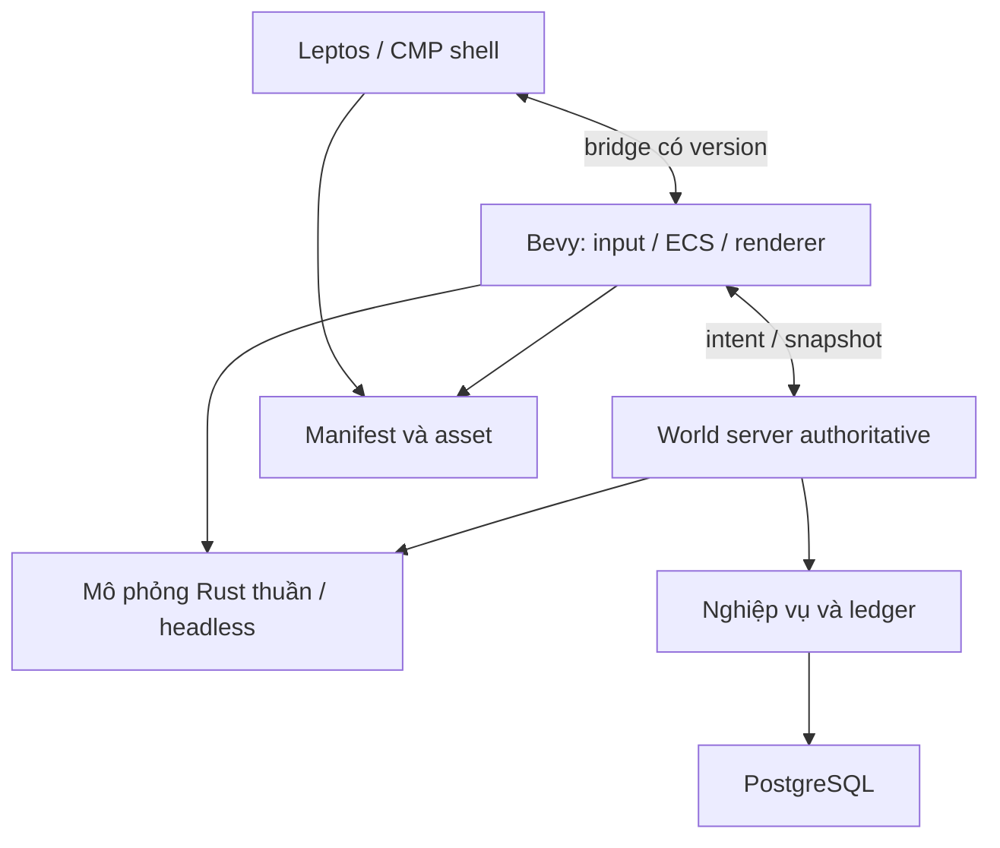

# Kiến trúc kỹ thuật — MyVa · Thần Mạch

**Trạng thái:** lựa chọn engine/ownership đã chốt trong [ADR 0003](../decisions/0003-bevy-engine-adoption.md), ngày 09/10/2026. Simulation/economy và graybox legacy đã có; networking, persistence và ngân sách dưới đây vẫn là thiết kế đề xuất. Spike web/native không đồng nghĩa sản phẩm đã đạt gate.

## 1. Quyết định và giới hạn

| Nội dung | Trạng thái |
| --- | --- |
| Game client Rust + Bevy `=0.20.0`, toolchain Rust `1.97.1` | Đã chọn và pin; xem ADR về feature flags/MSRV |
| Web shell Leptos `=0.8.22` CSR; mobile shell Kotlin Compose Multiplatform | Đã chọn; CMP integration/toolchain vẫn cần chứng minh trong D02 |
| Mobile dùng renderer native, không phụ thuộc WebView | Đích kiến trúc; gate Android và iOS thật còn riêng biệt |
| Online server authoritative | Bắt buộc với vị trí hợp lệ, chiến đấu, phần thưởng, giao dịch và tài nguyên |
| Backend Rust, Axum/Tokio, PostgreSQL | Đề xuất để làm MVP, chưa chốt phiên bản thư viện |
| Một backend module hóa trước, tách dịch vụ sau bằng số liệu | Đề xuất để giảm vận hành và giao dịch phân tán |
| 60 tick/giây, snapshot khoảng 20 lần/giây | Giả thuyết hiệu năng online, phải qua load test |

Bevy có sample native Android/iOS chính thức tại tag `v0.20.0`. Sample dùng Bevy/Winit làm chủ event loop; nó không chứng minh renderer nhúng được trực tiếp vào native view của CMP. [Compatibility matrix trong ADR](../decisions/0003-bevy-engine-adoption.md#compatibility-matrix-và-gate) phân biệt `KNOWN`, `UNKNOWN`, `BLOCKED`; kết quả từng run ở báo cáo prototype.

## 2. Phân chia trách nhiệm

Các tên bên dưới là **vai trò logic**, không phải yêu cầu tạo sẵn mọi crate/service.

| Thành phần | Sở hữu | Không sở hữu |
| --- | --- | --- |
| Mô phỏng Rust thuần (`myva-sim`) | Luật di chuyển, collision, combat, cooldown, RNG có seed, AI, replay/headless | Window, texture, audio, truy cập DB |
| Client Bevy | Input game, adapter ECS, prediction, renderer, animation, VFX, âm thanh gameplay khi được triển khai | Mint reward, định giá, phát hành tài nguyên, sửa ledger authoritative |
| Shell Leptos/CMP | Login, chọn nhân vật, tải nội dung, IME, navigation, thiết lập | Tự sửa trạng thái chiến đấu hoặc túi đồ |
| Server world | Phiên chơi, bản đồ, tick authoritative, kiểm tra command, interest management | Render đồ họa |
| Server nghiệp vụ | Nhân vật, inventory, nhiệm vụ, bang hội, ledger, giao dịch | Tin kết quả do client tự báo |
| PostgreSQL | Trạng thái bền vững, unique constraint, transaction, outbox | Lưu mọi frame render hoặc mọi snapshot mạng |
| Kho asset/CDN | Nội dung đã build, manifest theo phiên bản | Lệnh gameplay hoặc logic kinh tế có quyền thực thi |

Simulation nhận trạng thái, command và tick rồi trả trạng thái/sự kiện; server mới xác nhận command và kết quả online. Core thuần Rust là bộ luật duy nhất; [D04 / #12](https://github.com/loveoverflowcom/myva/issues/12) đã thêm schema lệnh/sự kiện versioned, fixed schedule `input → movement → collision → combat → status → events` trong `World::step`, domain entity ID khác Bevy `Entity`, và adapter `myva-gameplay` chỉ dùng `bevy_app`/`bevy_ecs`/`bevy_time` `=0.20.0` (không renderer/Winit/asset). Ownership, schedule, component và bằng chứng ở [nền gameplay ECS](gameplay-foundation.md).

`crates/graybox` dùng Macroquad là **implementation lịch sử chờ #12 rồi #2 chuyển đổi**. Không thêm công việc engine mới vào client legacy hoặc dùng nó làm bằng chứng Bevy đã hoàn thành.

## 3. Web: tách shell và game runtime

[D03 / #11](https://github.com/loveoverflowcom/myva/issues/11) chọn Leptos CSR cho shell và bundle Bevy WASM riêng. CSR không có bước server hydration; nếu sau này thêm SSR, chỉ mount game ở client sau khi canvas tồn tại [S2].

1. Leptos giữ DOM shell, navigation, loading/error và IME.
2. Khi người dùng vào game, mount iframe cùng origin; document game tạo canvas trước khi khởi tạo Bevy. Mỗi document chỉ khởi tạo runtime một lần.
3. Bridge shell/game dùng message có version/session, kiểm `origin` và `source`; bỏ message của lần mount cũ. Không đưa token vào URL, log hoặc manifest.
4. Game sở hữu canvas, input game và render loop. Shell giữ focus cho input/IME khi người dùng nhập văn bản; mất focus phải xóa phím đang giữ để không tiếp tục di chuyển.
5. Rời game tháo document iframe và dọn listener/handle của shell. Đây là boundary hủy runtime của spike; không giả định có thể restart `App::run`/Winit an toàn trong cùng document.
6. `Window.canvas`, `fit_canvas_to_parent` và browser event handling phải theo API `0.20.0`; container có kích thước độc lập canvas để tránh vòng lặp resize [S1].

[Báo cáo web D03](../reports/web-feasibility.md) ghi browser/build/command và phạm vi bằng chứng. D03 phải kiểm tra load/error/retry, resize/DPR, focus/keyboard/touch, visibility/pause, route enter/exit lặp, listener và memory. WebGL2 là cấu hình spike; WebGPU và từng browser/OS vẫn có kết quả riêng. Audio cần thao tác người dùng; hỗ trợ context loss/recovery không được suy ra từ load thành công. Không block event loop browser bằng I/O đồng bộ.

Bridge gửi sự kiện shell thưa, không JSON toàn thế giới mỗi frame. Gameplay/network ở runtime; server vẫn sở hữu authority. Cảnh di chuyển 2D kiểm chứng tích hợp không phải combat graybox đã chuyển đổi.

## 4. Mobile: feasibility gate trước khi cam kết sản xuất

[Native feasibility report](../reports/native-feasibility.md) ghi toolchain, code path, kết quả và blocker thực tế. D02 [#10](https://github.com/loveoverflowcom/myva/issues/10) thay spike Macroquad cũ #1.

Android Compose có `AndroidView`; CMP iOS có `UIKitView` để chứa native view [S3–S4]. Đây là hook UI cần nghiên cứu, không phải adapter Bevy đã có. `WinitPlugin` thay runner và tạo event loop; mobile không hưởng tùy chọn `run_on_any_thread` của Linux/Windows. Sample Android `#[bevy_main]`/GameActivity chạy standalone, không tự chấp nhận `SurfaceView` do CMP tạo [S5–S6].

| Hạng mục prototype | Bằng chứng cần có |
| --- | --- |
| Android embedded (A) | Rust library + CMP native surface có owner Activity/thread/context rõ; mất/tạo lại surface không giữ handle cũ |
| iOS embedded (A) | Rust library + native view/controller trong CMP; backend/thread, safe area, rotation, memory pressure được kiểm tra |
| Màn native riêng (B) | Chỉ đánh giá nếu A bị chặn; CMP điều hướng vào/ra game native và phục hồi được state, không chỉ chạy executable độc lập |
| Lifecycle | Vào/rời game 30 lần; background/resume 20 lần; resize/orientation; không crash, không giữ resource cũ |
| Input | Multi-touch, hủy touch, gamepad/keyboard nếu hỗ trợ; chuyển focus game/shell đúng |
| IME | Chat tiếng Việt do shell quản lý; mở bàn phím không làm người chơi tự di chuyển hoặc đánh |
| Audio | Một owner audio gameplay; interruption, tai nghe, mute/resume; không kết luận nếu chưa có audio harness |
| Hiệu năng | Profile game native và CMP overlay; không copy CPU toàn màn hình mỗi frame |
| Đóng gói | Build/release/signing và run Android/iPhone thật; ghi chính xác target/ABI/OS/device |

Source/probe trong D02 đã thấy `RecreationAttempt` khi dựng Winit loop lần hai và stock runner iOS yêu cầu tự gọi `UIApplicationMain` trước khi UIKit tồn tại. Vì vậy gọi `App::run()` trong CMP controller hiện hữu hoặc drop/tạo app mỗi lần navigation đều chưa là phương án hợp lệ. iOS A/B cần custom runner hoặc đảo ownership application; chứng minh trên thiết bị vẫn đang BLOCKED.

Hợp đồng adapter dự kiến: `create`, `resize`, `pause`, `resume`, `enqueue_input`, `poll_events`, `destroy`. ABI, allocator, native surface handles và thread chưa chốt; không viết như API có sẵn. FFI phải có mã lỗi và quy tắc cấp/giải phóng bộ nhớ khi implementation được chọn.

Nếu A cần sửa sâu runner/renderer hoặc không đạt lifecycle, báo kết quả và chi phí rồi thử B. Rollback **cách tích hợp**, không tự đổi engine hoặc dùng WebView. Thiếu thiết bị/SDK/host ghi `BLOCKED`; build standalone không đóng gate CMP native. Chưa vượt gate tương ứng thì chưa công bố mobile được hỗ trợ.

## 5. Tick, prediction và chiến đấu online

- Fixed step là ứng viên 60 Hz; render có thể chạy 60 FPS hoặc hạ 30 FPS mà không đổi tốc độ luật.
- Thời gian startup/active/recovery và cooldown biểu diễn bằng tick; stamina, tiền và số lượng vật phẩm dùng số nguyên.
- Không mặc định float cho kết quả bit-identical giữa native và WASM. Prototype so sánh replay; lượng hóa vị trí/va chạm hoặc chọn fixed-point cho phần cần tái lập sau khi đo sai lệch, overflow và chi phí.
- Server là nguồn đúng cuối cùng ngay cả khi client và server cùng dùng mã Rust.
- Client dự đoán di chuyển và phản hồi animation của chính mình; snapshot trả tick cùng input sequence đã xử lý để reconciliation.
- Nhân vật khác dùng interpolation; hạn chế extrapolation khi mất gói. HP, drop và inventory chỉ hiển thị chắc chắn sau xác nhận.
- Damage kiểm tra vị trí, trạng thái, resource, cooldown và mục tiêu trên server; không nhận lệnh “tôi gây X damage”.
- Tránh rollback vô hạn: giới hạn lịch sử, cửa sổ input và bù trễ; giới hạn cụ thể cần playtest độ công bằng giữa người né và người đánh.

MMORPG không đồng nghĩa trận đối kháng đạt cảm giác giống game local ở mọi độ trễ. Pilot kiểm tra RTT 50/100/150/250 ms, jitter và mất gói; nếu phản đòn ngắn không công bằng thì tăng telegraph/window hoặc giới hạn chế độ thi đấu theo chất lượng kết nối.

## 6. Giao thức và reconnect

MVP đề xuất WebSocket qua TLS để đồng nhất web/native, kết hợp HTTPS cho login và nội dung. Đây là điểm bắt đầu; phải đo head-of-line blocking trước khi cân nhắc transport khác.

Envelope có `protocol_version`, `session_epoch`, `sequence`, `server_tick` và payload có schema. Giới hạn kích thước, tốc độ message, độ sâu decode và thời gian xử lý; server từ chối version không tương thích.

Command gameplay là ý định: hướng di chuyển, jump, guard, skill và interaction. Mọi command bị kiểm tra quyền phiên, trạng thái nhân vật, tốc độ và cửa sổ tick.

Reconnect phát session epoch mới, vô hiệu command cũ và lấy snapshot đầy đủ; chỉ phát lại input chưa được ack nằm trong cửa sổ cho phép. Không phát lại giao dịch kinh tế bằng input combat; giao dịch dùng operation ID riêng để đọc kết quả hoặc retry an toàn.

Interest management gửi entity/sự kiện trong khu vực quan tâm. World boss và chiến dịch dùng nhóm instance có giới hạn; không gửi mọi entity toàn lục địa cho mỗi người chơi.

## 7. Dữ liệu bền vững và kinh tế

Tách dữ liệu tạm của combat khỏi dữ liệu sở hữu. Position/snapshot có thể được checkpoint theo ngân sách; vật phẩm, tiền, quest reward và phát hành tài nguyên phải có transaction bền vững.

| Nghiệp vụ | Quy tắc đề xuất |
| --- | --- |
| Nhặt vật phẩm | Drop ID và recipient; consume drop + cộng inventory một lần trong transaction |
| Quest reward | Unique key nhân vật/quest/reward; retry trả kết quả đã lưu |
| Giao dịch | Operation ID; kiểm tra số dư và ownership; debit/credit nguyên tử, khóa theo thứ tự ổn định |
| Craft/sửa chữa | Trừ nguyên liệu/tiền và tạo kết quả trong cùng transaction |
| Tài nguyên tái sinh | Ledger phát hành/thu hoạch/tiêu hao với budget khu vực; không dựa vào clock client |
| Thông báo ra world | Outbox commit cùng nghiệp vụ; consumer chống trùng theo event ID |

Crash sau commit nhưng trước phản hồi không được nhân đôi vật phẩm. Crash trước commit không được phát phần thưởng “đã thành công”. Command kinh tế chỉ ack thành công sau commit; lỗi DB làm thao tác tạm dừng và retry cùng operation ID.

World server không tự tăng lượng tài nguyên theo số channel. Trần tồn lượng và ngân sách phát hành có một nguồn sự thật toàn thế giới; linh vực, channel, instance và sự kiện mùa chỉ nhận phân bổ từ ngân sách đó. Đổi mùa không reset trần tồn lượng hoặc tạo ngân sách mới ngoài cấu hình đã ghi nhận. Grant chưa dùng, grant đang thu hoạch và inventory đều có cách đối soát; restart không tạo grant mới thay cho grant chưa ghi nhận.

PostgreSQL là lựa chọn đề xuất cho MVP; schema/migration, chiến lược khóa, index và retention phải thiết kế sau khi workload pilot rõ. Không tách DB vật lý cho từng bản đồ ở bước đầu. Backup có giá trị khi đã diễn tập restore, đối chiếu inventory và ledger.

## 8. Phạm vi tải và vận hành pilot

- Khởi điểm đề xuất: tối đa 50 phiên/channel và 200 phiên đồng thời toàn pilot; đây là giới hạn thử nghiệm, không phải capacity đã đạt.
- Thử tải 1×, 1,5× và 2× cap; đo tick p95/p99, hàng đợi command, bandwidth, lag ledger và transaction conflict.
- Tick 60 Hz có ngân sách 16,67 ms; mục tiêu p95 xử lý simulation ≤ 8 ms, p99 ≤ 12 ms trên cấu hình server được ghi lại.
- Snapshot mục tiêu 20 Hz; rate adaptation và giới hạn entity phải đo cùng cảnh combat thực tế.
- Admission control từ chối/mời chờ khi đầy; không mở channel vượt budget tài nguyên rồi nhân nguồn cung.
- Log correlation ID, tick, operation ID và lỗi protocol; không log token hoặc nội dung riêng tư mặc định.
- Tách health check, metric và admin thao tác khỏi cổng gameplay; thay đổi live economy có version và audit.

Chưa chọn vendor, máy chủ hay chi phí tháng. Benchmark phải ghi cấu hình, vùng mạng, DB, build profile và dữ liệu test để dự toán sau.

## 9. Cổng quyết định trước khi mở rộng

1. **Web integration:** shell + game tải riêng, focus đúng, teardown/routing an toàn, không leak sau vòng lặp vào/rời.
2. **Mobile native:** Android/iOS thật vượt checklist surface, input, IME, lifecycle và packaging.
3. **Combat network:** cảm giác né/đỡ/combo chấp nhận được dưới ma trận RTT; replay nhận diện lệch sim.
4. **Durability:** fault injection tại trước/sau commit; reconnect/restart không nhân thưởng, lặp trade hoặc tăng budget.
5. **Load:** cap pilot đạt tick/snapshot/memory budget; chỉ tăng cap sau khi có bằng chứng.

Các spike chỉ kiểm chứng boundary tích hợp. Chúng không thay thế gate ECS/headless [#12](https://github.com/loveoverflowcom/myva/issues/12), combat/playtest #2 hoặc vertical slice #4. Báo cáo riêng từng platform và giữ phần chưa chạy ở trạng thái BLOCKED/NOT_RUN.

## Nguồn kiểm chứng

Kiểm tra ngày **09/10/2026**. API/source được pin; lựa chọn kiến trúc và gate là hợp đồng của MyVa, không phải lời bảo đảm của thư viện.

- **[S1]** [Bevy 0.20 Window: canvas và resize](https://github.com/bevyengine/bevy/blob/v0.20.0/crates/bevy_window/src/window.rs).
- **[S2]** [Leptos: CSR và SSR](https://book.leptos.dev/getting_started/index.html).
- **[S3]** [Android Developers — Using Views in Compose](https://developer.android.com/develop/ui/compose/migrate/interoperability-apis/views-in-compose).
- **[S4]** [Kotlin — Integration with UIKit](https://kotlinlang.org/docs/multiplatform/compose-uikit-integration.html).
- **[S5]** [Bevy 0.20 WinitPlugin](https://github.com/bevyengine/bevy/blob/v0.20.0/crates/bevy_winit/src/lib.rs).
- **[S6]** [Bevy 0.20 mobile example](https://github.com/bevyengine/bevy/blob/v0.20.0/examples/mobile/src/lib.rs).
